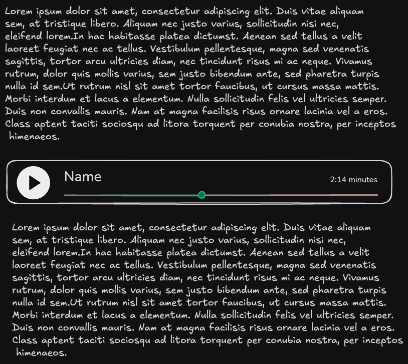

# Audio Player

## Functional Goal

Allow a user to reference an audio file in a document and have it become embedded in the document in a way which allows the audio to be played and paused.

## Syntax

The main directive is the `::audio` block element:

- the first and only required parameter is a reference to the audio
    - this can be a local audio file (most common)
    - but it can also be a URL to an audio file
    - for now we will only support WAV and MP3 codecs
- the second (and optional) parameter is a "name" for the audio clip; if not included the filename/url will be the name

## UI

When the `::audio` directive is rendered it will be rendered as inline html and is intended to look something like this:



## Technical Design

### Overview

The audio player system embeds audio content into markdown documents using HTML5 `<audio>` elements with custom styling. For standard rendering, audio files are referenced by path. For `toHTML()` output (self-contained HTML), audio files are base64-encoded inline to create truly portable documents.

### Dependencies

```toml
[dependencies]
# Audio metadata extraction
symphonia = { version = "0.5", features = ["mp3", "wav"] }

# Base64 encoding for toHTML inline embedding
base64 = "0.22"

# Hashing
xxhash-rust = { version = "0.8", features = ["xxh3"] }

# Caching
surrealdb = { version = "2", features = ["kv-rocksdb"] }

# Error handling
thiserror = "2"

# Logging
tracing = "0.1"
```

### Core Types

#### Input/Output Types

```rust
use std::path::PathBuf;
use std::time::Duration;

/// Source of an audio file to be processed.
#[derive(Debug, Clone)]
pub enum AudioSource {
    /// Local file path.
    Local(PathBuf),
    /// Remote URL (will be fetched and cached).
    Remote(String),
}

impl AudioSource {
    /// Compute the resource hash (hash of identifier, not content).
    pub fn resource_hash(&self) -> u64 {
        use xxhash_rust::xxh3::xxh3_64;
        match self {
            AudioSource::Local(path) => xxh3_64(path.to_string_lossy().as_bytes()),
            AudioSource::Remote(url) => xxh3_64(url.as_bytes()),
        }
    }

    /// Format resource hash as hex string for filenames.
    pub fn resource_hash_hex(&self) -> String {
        format!("{:016x}", self.resource_hash())
    }
}

/// Input to the audio processing function.
#[derive(Debug, Clone)]
pub struct AudioInput {
    /// The source audio file (local file or remote URL).
    pub source: AudioSource,
    /// Optional name/title for the audio (if not provided, filename/url is used).
    pub name: Option<String>,
}

/// Result of processing a single audio file.
#[derive(Debug, Clone)]
pub struct AudioOutput {
    /// The resource hash (base filename).
    pub hash: String,
    /// Audio format (mp3 or wav).
    pub format: AudioFormat,
    /// Path to the audio file (for standard rendering).
    pub path: PathBuf,
    /// Base64-encoded audio data (for toHTML inline rendering).
    pub base64_data: Option<String>,
    /// Extracted metadata.
    pub metadata: AudioMetadata,
    /// Display name for the audio.
    pub display_name: String,
}

/// Supported audio formats.
#[derive(Debug, Clone, Copy, PartialEq, Eq)]
pub enum AudioFormat {
    Mp3,
    Wav,
}

impl AudioFormat {
    /// Detect format from file extension.
    pub fn from_extension(ext: &str) -> Option<Self> {
        match ext.to_lowercase().as_str() {
            "mp3" => Some(AudioFormat::Mp3),
            "wav" => Some(AudioFormat::Wav),
            _ => None,
        }
    }

    /// Get MIME type for HTML.
    pub fn mime_type(&self) -> &'static str {
        match self {
            AudioFormat::Mp3 => "audio/mpeg",
            AudioFormat::Wav => "audio/wav",
        }
    }

    /// Get file extension.
    pub fn extension(&self) -> &'static str {
        match self {
            AudioFormat::Mp3 => "mp3",
            AudioFormat::Wav => "wav",
        }
    }
}

/// Extracted audio metadata.
#[derive(Debug, Clone, Default)]
pub struct AudioMetadata {
    /// Duration of the audio file.
    pub duration: Option<Duration>,
    /// Bitrate in kbps.
    pub bitrate: Option<u32>,
    /// Sample rate in Hz.
    pub sample_rate: Option<u32>,
    /// Number of channels (1 = mono, 2 = stereo).
    pub channels: Option<u8>,
    /// ID3 title tag (if present).
    pub title: Option<String>,
    /// ID3 artist tag (if present).
    pub artist: Option<String>,
    /// ID3 album tag (if present).
    pub album: Option<String>,
}
```

#### Error Types

```rust
use thiserror::Error;
use std::path::PathBuf;

#[derive(Error, Debug)]
pub enum AudioError {
    #[error("Failed to read audio file: {path}")]
    ReadFailed {
        path: PathBuf,
        #[source]
        source: std::io::Error,
    },

    #[error("Unsupported audio format: {extension}")]
    UnsupportedFormat { extension: String },

    #[error("Failed to fetch remote audio: {url}")]
    FetchFailed {
        url: String,
        #[source]
        source: reqwest::Error,
    },

    #[error("Failed to extract audio metadata")]
    MetadataFailed {
        #[source]
        source: symphonia::core::errors::Error,
    },

    #[error("Cache operation failed")]
    CacheFailed {
        #[source]
        source: surrealdb::Error,
    },

    #[error("I/O error: {0}")]
    Io(#[from] std::io::Error),
}

pub type Result<T> = std::result::Result<T, AudioError>;
```

### Audio Cache Schema

The cache uses SurrealDB to track audio files and avoid reprocessing.

#### SurrealDB Schema

```sql
-- Table: audio_cache
-- Stores cache entries keyed by resource hash

DEFINE TABLE audio_cache SCHEMAFULL;

-- Resource hash (hash of file path or URL)
DEFINE FIELD resource_hash ON audio_cache TYPE string;
-- Content hash (hash of actual audio bytes)
DEFINE FIELD content_hash ON audio_cache TYPE string;
-- Timestamp when cache entry was created
DEFINE FIELD created_at ON audio_cache TYPE datetime DEFAULT time::now();
-- Source type: "local" or "remote"
DEFINE FIELD source_type ON audio_cache TYPE string;
-- Original source path/URL for debugging
DEFINE FIELD source ON audio_cache TYPE string;
-- Audio format (mp3 or wav)
DEFINE FIELD format ON audio_cache TYPE string;
-- Duration in seconds
DEFINE FIELD duration_secs ON audio_cache TYPE option<float>;
-- Bitrate in kbps
DEFINE FIELD bitrate ON audio_cache TYPE option<int>;

-- Index for fast lookup by resource hash
DEFINE INDEX idx_resource_hash ON audio_cache FIELDS resource_hash UNIQUE;
```

#### Rust Cache Types

```rust
use serde::{Deserialize, Serialize};
use surrealdb::RecordId;

#[derive(Debug, Serialize, Deserialize)]
pub struct AudioCacheEntry {
    pub id: RecordId,
    pub resource_hash: String,
    pub content_hash: String,
    pub created_at: chrono::DateTime<chrono::Utc>,
    pub source_type: String,
    pub source: String,
    pub format: String,
    pub duration_secs: Option<f64>,
    pub bitrate: Option<u32>,
}

#[derive(Debug, Serialize)]
pub struct NewAudioCacheEntry {
    pub resource_hash: String,
    pub content_hash: String,
    pub source_type: String,
    pub source: String,
    pub format: String,
    pub duration_secs: Option<f64>,
    pub bitrate: Option<u32>,
}
```

#### Cache Operations

```rust
use surrealdb::{Surreal, engine::local::RocksDb};

pub struct AudioCache {
    db: Surreal<surrealdb::engine::local::Db>,
}

impl AudioCache {
    /// Initialize cache with embedded RocksDB.
    pub async fn new(db_path: &Path) -> Result<Self> {
        let db = Surreal::new::<RocksDb>(db_path).await
            .map_err(|e| AudioError::CacheFailed { source: e })?;

        db.use_ns("composition").use_db("cache").await
            .map_err(|e| AudioError::CacheFailed { source: e })?;

        Ok(Self { db })
    }

    /// Check if a valid cache entry exists.
    pub async fn get(&self, resource_hash: &str, content_hash: &str) -> Result<Option<AudioCacheEntry>> {
        let mut response = self.db
            .query("SELECT * FROM audio_cache WHERE resource_hash = $rh AND content_hash = $ch")
            .bind(("rh", resource_hash))
            .bind(("ch", content_hash))
            .await
            .map_err(|e| AudioError::CacheFailed { source: e })?;

        let entry: Option<AudioCacheEntry> = response.take(0)
            .map_err(|e| AudioError::CacheFailed { source: e })?;

        Ok(entry)
    }

    /// Insert or update cache entry.
    pub async fn upsert(&self, entry: NewAudioCacheEntry) -> Result<()> {
        self.db
            .query(r#"
                DELETE FROM audio_cache WHERE resource_hash = $resource_hash;
                CREATE audio_cache CONTENT $entry;
            "#)
            .bind(("resource_hash", &entry.resource_hash))
            .bind(("entry", &entry))
            .await
            .map_err(|e| AudioError::CacheFailed { source: e })?;

        Ok(())
    }
}
```

### Audio Processing Pipeline

#### Main Entry Point

```rust
use std::path::Path;
use tracing::{info, instrument};

/// Process an audio file reference.
#[instrument(skip(input, cache))]
pub fn process_audio(
    input: AudioInput,
    output_dir: &Path,
    cache: &AudioCache,
    inline_mode: bool,
) -> Result<AudioOutput> {
    let resource_hash = input.source.resource_hash_hex();

    // Step 1: Load source audio bytes
    let (bytes, source_str) = load_audio_bytes(&input.source)?;

    // Step 2: Detect format
    let format = detect_audio_format(&input.source, &bytes)?;

    // Step 3: Compute content hash
    let content_hash = compute_content_hash(&bytes);

    // Step 4: Check cache
    let handle = tokio::runtime::Handle::current();
    let cached = handle.block_on(async {
        cache.get(&resource_hash, &content_hash).await
    })?;

    let metadata = if let Some(entry) = cached {
        info!(hash = %resource_hash, "Cache hit - using cached metadata");
        AudioMetadata {
            duration: entry.duration_secs.map(Duration::from_secs_f64),
            bitrate: entry.bitrate,
            ..Default::default()
        }
    } else {
        // Step 5: Extract metadata
        let metadata = extract_audio_metadata(&bytes, format)?;

        // Step 6: Update cache
        let cache_entry = NewAudioCacheEntry {
            resource_hash: resource_hash.clone(),
            content_hash: content_hash.clone(),
            source_type: match &input.source {
                AudioSource::Local(_) => "local".to_string(),
                AudioSource::Remote(_) => "remote".to_string(),
            },
            source: source_str.clone(),
            format: format.extension().to_string(),
            duration_secs: metadata.duration.map(|d| d.as_secs_f64()),
            bitrate: metadata.bitrate,
        };
        handle.block_on(async {
            cache.upsert(cache_entry).await
        })?;

        metadata
    };

    // Step 7: Copy audio file to output directory (if not inline mode)
    let audio_dir = output_dir.join("audio");
    std::fs::create_dir_all(&audio_dir)?;

    let filename = format!("{}.{}", resource_hash, format.extension());
    let output_path = audio_dir.join(&filename);

    if !output_path.exists() {
        std::fs::write(&output_path, &bytes)?;
    }

    // Step 8: Generate base64 data if inline mode
    let base64_data = if inline_mode {
        Some(base64::engine::general_purpose::STANDARD.encode(&bytes))
    } else {
        None
    };

    // Step 9: Determine display name
    let display_name = input.name
        .or_else(|| metadata.title.clone())
        .unwrap_or_else(|| {
            match &input.source {
                AudioSource::Local(path) => {
                    path.file_stem()
                        .and_then(|s| s.to_str())
                        .unwrap_or("Audio")
                        .to_string()
                }
                AudioSource::Remote(url) => {
                    url.split('/').last().unwrap_or("Audio").to_string()
                }
            }
        });

    Ok(AudioOutput {
        hash: resource_hash,
        format,
        path: output_path,
        base64_data,
        metadata,
        display_name,
    })
}
```

#### Helper Functions

```rust
use symphonia::core::formats::FormatOptions;
use symphonia::core::io::MediaSourceStream;
use symphonia::core::meta::MetadataOptions;
use symphonia::core::probe::Hint;
use xxhash_rust::xxh3::xxh3_64;
use std::io::Cursor;

/// Load bytes from local file or remote URL.
fn load_audio_bytes(source: &AudioSource) -> Result<(Vec<u8>, String)> {
    match source {
        AudioSource::Local(path) => {
            let bytes = std::fs::read(path)
                .map_err(|e| AudioError::ReadFailed { path: path.clone(), source: e })?;
            Ok((bytes, path.to_string_lossy().to_string()))
        }
        AudioSource::Remote(url) => {
            // Note: Actual implementation would use reqwest
            unimplemented!("Remote fetching requires async HTTP client")
        }
    }
}

/// Detect audio format from source and content.
fn detect_audio_format(source: &AudioSource, bytes: &[u8]) -> Result<AudioFormat> {
    // First try extension-based detection
    let ext_format = match source {
        AudioSource::Local(path) => {
            path.extension()
                .and_then(|e| e.to_str())
                .and_then(AudioFormat::from_extension)
        }
        AudioSource::Remote(url) => {
            url.split('.').last()
                .and_then(AudioFormat::from_extension)
        }
    };

    if let Some(format) = ext_format {
        return Ok(format);
    }

    // Fall back to magic byte detection
    if bytes.len() >= 3 {
        // MP3: ID3 tag or MPEG frame sync
        if &bytes[0..3] == b"ID3" || (bytes[0] == 0xFF && (bytes[1] & 0xE0) == 0xE0) {
            return Ok(AudioFormat::Mp3);
        }
        // WAV: RIFF header
        if bytes.len() >= 12 && &bytes[0..4] == b"RIFF" && &bytes[8..12] == b"WAVE" {
            return Ok(AudioFormat::Wav);
        }
    }

    Err(AudioError::UnsupportedFormat {
        extension: "unknown".to_string(),
    })
}

/// Compute XXH3-64 hash of audio content.
fn compute_content_hash(bytes: &[u8]) -> String {
    format!("{:016x}", xxh3_64(bytes))
}

/// Extract audio metadata using Symphonia.
fn extract_audio_metadata(bytes: &[u8], format: AudioFormat) -> Result<AudioMetadata> {
    let cursor = Cursor::new(bytes);
    let mss = MediaSourceStream::new(Box::new(cursor), Default::default());

    let mut hint = Hint::new();
    hint.with_extension(format.extension());

    let format_opts = FormatOptions::default();
    let metadata_opts = MetadataOptions::default();

    let probed = symphonia::default::get_probe()
        .format(&hint, mss, &format_opts, &metadata_opts)
        .map_err(|e| AudioError::MetadataFailed { source: e })?;

    let mut metadata = AudioMetadata::default();

    // Extract format information
    if let Some(track) = probed.format.default_track() {
        let codec_params = &track.codec_params;

        metadata.sample_rate = codec_params.sample_rate;
        metadata.channels = codec_params.channels.map(|c| c.count() as u8);

        // Calculate duration
        if let (Some(rate), Some(n_frames)) = (codec_params.sample_rate, codec_params.n_frames) {
            let duration_secs = n_frames as f64 / rate as f64;
            metadata.duration = Some(Duration::from_secs_f64(duration_secs));
        }

        // Estimate bitrate (if available)
        if let Some(max_bitrate) = codec_params.max_bitrate {
            metadata.bitrate = Some(max_bitrate / 1000); // Convert to kbps
        }
    }

    // Extract ID3/metadata tags
    if let Some(metadata_rev) = probed.format.metadata().current() {
        for tag in metadata_rev.tags() {
            match tag.key.as_str() {
                "TITLE" | "TIT2" => metadata.title = Some(tag.value.to_string()),
                "ARTIST" | "TPE1" => metadata.artist = Some(tag.value.to_string()),
                "ALBUM" | "TALB" => metadata.album = Some(tag.value.to_string()),
                _ => {}
            }
        }
    }

    Ok(metadata)
}
```

### HTML Generation

#### Configuration

```rust
/// Options for HTML audio player generation.
#[derive(Debug, Clone)]
pub struct AudioHtmlOptions {
    /// Whether to use inline base64 encoding (for toHTML mode).
    pub inline: bool,
    /// Custom CSS class to add to the player container.
    pub class: Option<String>,
}

impl Default for AudioHtmlOptions {
    fn default() -> Self {
        Self {
            inline: false,
            class: None,
        }
    }
}
```

#### HTML Generation Implementation

```rust
/// Generate HTML audio player element.
pub fn generate_audio_html(output: &AudioOutput, options: &AudioHtmlOptions) -> String {
    let mut html = String::new();

    // Container div
    let class_attr = options.class.as_ref()
        .map(|c| format!(r#" class="{}""#, c))
        .unwrap_or_default();

    html.push_str(&format!(r#"<div class="audio-player"{}>"#, class_attr));
    html.push('\n');

    // Audio element with controls
    html.push_str(r#"  <audio controls preload="metadata">"#);
    html.push('\n');

    // Source element
    let src = if options.inline {
        if let Some(base64) = &output.base64_data {
            format!("data:{};base64,{}", output.format.mime_type(), base64)
        } else {
            output.path.display().to_string()
        }
    } else {
        output.path.display().to_string()
    };

    html.push_str(&format!(
        r#"    <source src="{}" type="{}">"#,
        html_escape(&src),
        output.format.mime_type()
    ));
    html.push('\n');

    // Fallback text
    html.push_str(r#"    Your browser does not support the audio element."#);
    html.push('\n');
    html.push_str(r#"  </audio>"#);
    html.push('\n');

    // Audio metadata display
    html.push_str(r#"  <div class="audio-info">"#);
    html.push('\n');
    html.push_str(&format!(
        r#"    <span class="audio-name">{}</span>"#,
        html_escape(&output.display_name)
    ));
    html.push('\n');

    if let Some(duration) = output.metadata.duration {
        let minutes = duration.as_secs() / 60;
        let seconds = duration.as_secs() % 60;
        html.push_str(&format!(
            r#"    <span class="audio-duration">{:}:{:02}</span>"#,
            minutes, seconds
        ));
        html.push('\n');
    }

    html.push_str(r#"  </div>"#);
    html.push('\n');

    // Close container
    html.push_str(r#"</div>"#);

    html
}

/// Escape HTML special characters.
fn html_escape(s: &str) -> String {
    s.replace('&', "&amp;")
        .replace('<', "&lt;")
        .replace('>', "&gt;")
        .replace('"', "&quot;")
}
```

#### CSS Styling

The generated HTML should be accompanied by CSS that matches the design in the mockup:

```css
.audio-player {
  display: flex;
  flex-direction: column;
  gap: 0.5rem;
  padding: 1rem;
  border: 2px solid #e5e7eb;
  border-radius: 0.5rem;
  background-color: #1f2937;
  color: #f9fafb;
  max-width: 800px;
}

.audio-player audio {
  width: 100%;
  height: 40px;
}

.audio-info {
  display: flex;
  justify-content: space-between;
  align-items: center;
  font-size: 0.875rem;
}

.audio-name {
  font-weight: 500;
}

.audio-duration {
  color: #9ca3af;
  font-variant-numeric: tabular-nums;
}

/* Custom audio controls styling (browser-specific) */
.audio-player audio::-webkit-media-controls-panel {
  background-color: #374151;
}

.audio-player audio::-webkit-media-controls-current-time-display,
.audio-player audio::-webkit-media-controls-time-remaining-display {
  color: #f9fafb;
}
```

### Example Output

#### Standard Mode (File Reference)

For `::audio ./podcast.mp3 "Episode 42"`:

```html
<div class="audio-player">
  <audio controls preload="metadata">
    <source src="audio/a1b2c3d4e5f67890.mp3" type="audio/mpeg">
    Your browser does not support the audio element.
  </audio>
  <div class="audio-info">
    <span class="audio-name">Episode 42</span>
    <span class="audio-duration">12:34</span>
  </div>
</div>
```

#### Inline Mode (Base64 for toHTML)

For `toHTML()` output, the same directive generates:

```html
<div class="audio-player">
  <audio controls preload="metadata">
    <source src="data:audio/mpeg;base64,SUQzBAAAAAAAI1RTU0UAAAAPAAADTGF2ZjU4Ljc..." type="audio/mpeg">
    Your browser does not support the audio element.
  </audio>
  <div class="audio-info">
    <span class="audio-name">Episode 42</span>
    <span class="audio-duration">12:34</span>
  </div>
</div>
```

### Integration with Markdown Parser

The audio directive is processed during the markdown parsing phase:

```rust
// In pulldown-cmark event stream processing
match event {
    Event::Text(text) if text.starts_with("::audio ") => {
        let parts: Vec<&str> = text.trim_start_matches("::audio ").splitn(2, ' ').collect();
        let path = parts[0];
        let name = parts.get(1).map(|s| s.trim_matches('"').to_string());

        let input = AudioInput {
            source: AudioSource::Local(PathBuf::from(path)),
            name,
        };

        let output = process_audio(input, output_dir, cache, inline_mode)?;
        let html = generate_audio_html(&output, &AudioHtmlOptions::default());

        // Emit as inline HTML event
        Event::Html(html.into())
    }
    _ => event,
}
```

### Performance Considerations

1. **Caching**: Audio metadata extraction is cached by content hash to avoid reprocessing
2. **No Transcoding**: Audio files are copied as-is; no format conversion overhead
3. **Lazy Loading**: HTML5 `preload="metadata"` only loads metadata initially, not full audio
4. **Base64 Trade-off**: Inline mode increases HTML size by ~33% but creates self-contained documents
5. **Parallel Processing**: When processing multiple audio files, use rayon for concurrent metadata extraction

### Browser Compatibility

The HTML5 `<audio>` element is supported in all modern browsers:

| Browser | MP3 Support | WAV Support |
|---------|-------------|-------------|
| Chrome  | ✓           | ✓           |
| Firefox | ✓           | ✓           |
| Safari  | ✓           | ✓           |
| Edge    | ✓           | ✓           |

### Future Enhancements

1. **Additional Formats**: Add support for OGG, FLAC, AAC
2. **Waveform Visualization**: Generate SVG waveform previews
3. **Playlist Support**: `::audio-playlist` directive for multiple files
4. **Timestamps**: Support `::audio ./file.mp3 --start 1:30 --end 3:45` for clips
5. **Custom Player**: Replace native controls with JavaScript-based custom player for consistent UI across browsers
6. **Streaming**: For large audio files, support chunked streaming instead of full file embedding
