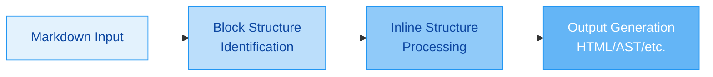

# GitHub Flavored Markdown (GFM) Standard and Working with Pulldown-Cmark in Rust

## 1 Overview of GitHub Flavored Markdown (GFM)

**GitHub Flavored Markdown (GFM)** is a **strict superset** of the **CommonMark** specification, serving as the dialect of Markdown supported for user content on GitHub.com and GitHub Enterprise. GFM extends the base CommonMark standard with several **additional features** that have become widely adopted in various platforms while maintaining compatibility with the core specification. The formal specification (currently version 0.29-gfm released on 2019-04-06) is based on the CommonMark Spec by John MacFarlane and provides a precise, unambiguous definition of the syntax and semantics of this dialect.

### 1.1 Relationship to CommonMark

GFM is built upon the foundation of CommonMark, which was created to address the **ambiguities** and **inconsistencies** in the original Markdown description by John Gruber. While CommonMark provides a strongly defined, highly compatible specification of Markdown, GFM adds several **popular extensions** that were not part of the original standard but were needed for GitHub's use cases. All CommonMark documents are valid GFM documents, but not all GFM documents are valid CommonMark due to these extensions.

### 1.2 Design Philosophy

The overriding design goal for Markdown's formatting syntax is to make it as **readable as possible**. The idea is that a Markdown-formatted document should be publishable as-is, as plain text, without looking like it's been marked up with tags or formatting instructions. This principle is maintained in GFM, where even with the added extensions, the source text remains highly readable.

## 2 Core GFM Extensions Beyond CommonMark

GFM introduces several key extensions that enhance the base CommonMark functionality. These extensions are designed to address common needs while maintaining readability and compatibility.

### 2.1 Tables

Tables allow for structured data presentation using a simple pipe-based syntax:

```markdown
| Header 1 | Header 2 | Header 3 |
|----------|----------|----------|
| Cell 1   | Cell 2   | Cell 3   |
| Cell 4   | Cell 5   | Cell 6   |
```

Tables are part of the GFM specification but not included in the base CommonMark spec.

### 2.2 Task List Items

Task lists extend regular lists with checkbox functionality:

```markdown
- [x] Completed task
- [ ] Incomplete task
```

This feature is particularly useful for project management and issue tracking.

### 2.3 Strikethrough Text

Strikethrough allows for text to be marked as deleted or no longer relevant:

```markdown
~~This text is struck through~~
```

This uses one or two tildes around the text to be struck through.

### 2.4 Autolinks (Extended)

GFM extends autolinking to automatically detect and convert URLs without explicit markup:

```markdown
https://github.com
```

This will be automatically converted to a link without needing surrounding angle brackets.

### 2.5 Disallowed Raw HTML

For security reasons, GFM restricts certain HTML tags that could be used for malicious purposes. This extension defines which HTML tags are allowed and which are disallowed in user content.

*Table: Comparison of CommonMark and GFM Features*

| **Feature** | **CommonMark** | **GFM** | **Description** |
|-------------|----------------|---------|-----------------|
| Tables      | ❌             | ✅      | Pipe-based table syntax |
| Task Lists  | ❌             | ✅      | Checkbox functionality in lists |
| Strikethrough | ❌          | ✅      | Tilde-wrapped text for deletion |
| Autolinks   | Limited        | Extended| Broader URL detection |
| HTML Restrictions | ❌      | ✅      | Security-focused HTML filtering |

## 3 GFM Parsing Strategy

The GFM specification outlines a **two-phase parsing strategy** that efficiently converts Markdown to the desired output format:

### 3.1 Phase 1: Block Structure

This phase identifies the **block-level elements** in the document, such as headings, paragraphs, lists, code blocks, and tables. The parser scans the document line by line, determining the type of each block and how blocks are nested within each other. This phase establishes the **document skeleton** without processing inline formatting.

### 3.2 Phase 2: Inline Structure

Once the block structure is established, this phase processes the **inline elements** within each block, such as emphasis, links, images, code spans, and autolinks. This phase handles the more granular aspects of Markdown parsing, resolving text formatting and link references.



## 4 Introduction to Pulldown-Cmark

**Pulldown-Cmark** is a **pull parser** for CommonMark written in Rust, designed with performance and flexibility in mind. It serves as the foundation for GFM parsing in Rust applications and provides a low-level event-based API that gives developers fine-grained control over the parsing process.

### 4.1 Design Philosophy

Unlike push parsers that generate a complete document tree immediately, pulldown-cmark produces a **stream of events** that can be processed incrementally. This approach offers several advantages:

- **Memory efficiency**: No need to hold the entire document tree in memory
- **Performance**: Parsing can begin before the entire document is available
- **Flexibility**: Developers can transform or filter the event stream as needed
- **Streaming support**: Well-suited for processing large documents or network streams

### 4.2 Architecture

The crate is structured around several key components:

- **Parser**: The main struct that implements the parsing logic and generates events
- **Event**: Enum representing the different types of markdown elements encountered
- **Tag**: Enum representing the different types of block and inline elements
- **Options**: Configuration for enabling extensions beyond CommonMark

## 5 Working with GFM in Pulldown-Cmark

To effectively work with GFM in pulldown-cmark, you need to understand how to enable extensions and process the resulting event stream.

### 5.1 Enabling GFM Extensions

By default, pulldown-cmark only supports the CommonMark standard. To use GFM features, you must explicitly enable them through the `Options` struct:

```rust
use pulldown_cmark::{Parser, Options};

let markdown_input = "# Hello\n\nThis is ~~strikethrough~~ text.";
let mut options = Options::empty();
options.insert(Options::ENABLE_STRIKETHROUGH);
let parser = Parser::new_ext(markdown_input, options);
```

*Table: Available GFM Extensions in Pulldown-Cmark*

| **Extension** | **Option Flag** | **Description** |
|---------------|-----------------|-----------------|
| Tables        | `ENABLE_TABLES` | Support for pipe-based tables |
| Task Lists    | `ENABLE_TASKLISTS` | Checkbox functionality in lists |
| Strikethrough | `ENABLE_STRIKETHROUGH` | Tilde-wrapped text for deletion |
| Footnotes     | `ENABLE_FOOTNOTES` | Footnote syntax support |
| Smart Punctuation | `ENABLE_SMART_PUNCTUATION` | Automatic punctuation replacement |

### 5.2 Processing the Event Stream

The parser produces a stream of events that you can process directly or convert to HTML:

```rust
use pulldown_cmark::{Parser, Options, html};
use pulldown_cmark::Event;

let markdown_input = "Hello **world**!";
let parser = Parser::new(markdown_input);

// Process events directly
for event in parser {
    match event {
        Event::Text(text) => println!("Text: {}", text),
        Event::Start(tag) => println!("Start: {:?}", tag),
        Event::End(tag) => println!("End: {:?}", tag),
        _ => ()
    }
}

// Or convert to HTML
let parser = Parser::new(markdown_input);
let mut html_output = String::new();
html::push_html(&mut html_output, parser);
```

### 5.3 Handling Text Events

Consecutive text events can occur due to the manner in which the parser evaluates the source. Pulldown-cmark provides a `TextMergeStream` utility to improve the comfort of iterating the events:

```rust
use pulldown_cmark::{Event, Parser, TextMergeStream};

let markdown_input = "Hello world, this is a ~~complicated~~ *very simple* example.";
let iterator = TextMergeStream::new(Parser::new(markdown_input));
for event in iterator {
    match event {
        Event::Text(text) => println!("{}", text),
        _ => {}
    }
}
```

## 6 Advanced Techniques with Pulldown-Cmark

Beyond basic parsing, pulldown-cmark offers several advanced capabilities for working with GFM content.

### 6.1 Custom Parsing and Transformation

Because pulldown-cmark provides an event stream, you can easily transform the content during parsing:

```rust
use pulldown_cmark::{Parser, Event, Tag, Options};

let markdown_input = "";
let mut options = Options::empty();
options.insert(Options::ENABLE_FOOTNOTES);
let parser = Parser::new_ext(markdown_input, options);

let transformed_events: Vec<Event> = parser
    .map(|event| match event {
        Event::Start(Tag::Image(..)) => Event::Start(Tag::Image(
            pulldown_cmark::LinkType::Inline,
            "modified.png".into(),
            "modified title".into(),
        )),
        other => other,
    })
    .collect();
```

### 6.2 Working with Frontmatter

While not part of the GFM spec, frontmatter is commonly used in Markdown documents. The `pulldown-cmark-frontmatter` crate extends pulldown-cmark to handle frontmatter:

```rust
use pulldown_cmark_frontmatter::FrontmatterExtractor;

let markdown_input = include_str!("document-with-frontmatter.md");
let mut extractor = FrontmatterExtractor::new(pulldown_cmark::Parser::new(markdown_input));

let mut html_output = String::new();
pulldown_cmark::html::push_html(&mut html_output, &mut extractor);

let frontmatter = extractor.frontmatter.expect("frontmatter not detected");
println!("Title: {:?}", frontmatter.title);
```

### 6.3 Generating Table of Contents

The `pulldown-cmark-toc` crate can generate a table of contents from a Markdown document:

```rust
use pulldown_cmark_toc::Toc;

let markdown_input = include_str!("document.md");
let toc = Toc::new(markdown_input);
println!("{}", toc.to_html());
```

## 7 Best Practices for Working with GFM and Pulldown-Cmark

When working with GFM and pulldown-cmark, consider the following best practices:

### 7.1 Performance Considerations

- **Use streaming for large documents**: Process the event stream incrementally rather than collecting all events first
- **Enable only necessary extensions**: Each enabled extension adds parsing overhead
- **Reuse parser instances**: When parsing multiple documents, consider reusing parser configurations

### 7.2 Security Considerations

- **Sanitize HTML output**: Even with GFM's disallowed raw HTML, consider additional sanitization for user-generated content
- **Handle broken links**: Implement proper broken link callbacks to avoid unexpected behavior

### 7.3 Compatibility Considerations

- **Test against GitHub's renderer**: Since GFM is defined by GitHub's implementation, test edge cases against actual GitHub rendering
- **Consider CommonMark compliance**: For maximum compatibility, ensure your content works with both CommonMark and GFM parsers

## 8 Conclusion

GitHub Flavored Markdown provides a **well-defined superset** of CommonMark that adds several useful extensions while maintaining the core principles of readability and simplicity. The pulldown-cmark crate offers a **powerful and flexible** way to parse GFM content in Rust applications, with fine-grained control over the parsing process and support for all major GFM extensions.

By understanding both the GFM specification and the capabilities of pulldown-cmark, developers can effectively work with Markdown content in Rust applications, whether they're building documentation systems, content management platforms, or developer tools that need to process Markdown content.

The combination of GFM's standardized extensions and pulldown-cmark's event-based parsing approach provides a solid foundation for building robust Markdown processing applications that are both performant and compatible with GitHub's implementation.
