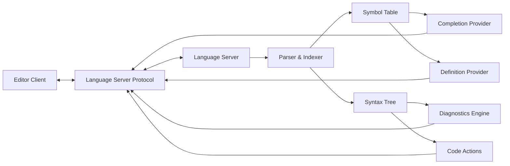

# Comprehensive Analysis of Language Server Protocol (LSP) and Its Relationship with Linters and Formatters

## Introduction to Language Server Protocol (LSP)

The **Language Server Protocol (LSP)** is a **standardized communication protocol** that enables **integration between code editors** and **language tools**. Developed by Microsoft in 2016, LSP has revolutionized how language intelligence is delivered across different development environments. The protocol defines a **JSON-RPC-based interface** that facilitates communication between a **language server** (which provides language features) and a **language client** (integrated into editors). This standardization eliminates the need for tool developers to create separate plugins for each editor, significantly reducing the **M×N problem** (where M languages need N editor integrations).

The LSP architecture consists of three main components:

- **Workspace**: The directory containing files being worked on
- **Editor**: The code editor that reads/writes files and communicates with the language server
- **Language Server**: Provides language intelligence features like autocomplete, diagnostics, and code navigation

The protocol enables **real-time communication** where the editor sends notifications about file changes to the language server, which responds with relevant language information. This communication happens through **specific message types** including `textDocument/didChange`, `textDocument/completion`, and `textDocument/formatting`.

## LSP Architecture and Core Capabilities

### Technical Architecture

The LSP architecture follows a **client-server model** where the language server runs in a **separate process** from the editor. This separation provides several advantages:

- **Language independence**: Language servers can be implemented in any programming language
- **Performance isolation**: Resource-intensive operations don't block the editor UI
- **Standardization**: Uniform API across different editors and languages

### Core LSP Capabilities

Language servers typically implement several **standard capabilities** that enhance the coding experience:

- **Completions**: Provides intelligent code completion based on context and project analysis
- **Diagnostics**: Reports syntax errors, type errors, and lint warnings in real-time
- **Hover Information**: Displays documentation, type information, and symbol details on hover
- **Go to Definition/Implementation**: Enables navigation to symbol definitions and implementations
- **Find References**: Locates all usages of a symbol across the project
- **Code Actions**: Suggests automatic fixes for detected issues (refactoring, quick fixes)
- **Symbol Search**: Allows searching for symbols within the workspace
- **Formatting**: Provides code formatting capabilities (though not universally implemented)

## Linters and Formatters: Roles and Relationship with LSP

### Understanding Linters

**Linters** are static analysis tools that **analyze source code** to detect **programmatic errors**, **bugs**, **stylistic issues**, and **suspicious constructs**. Traditional linters operate as standalone tools that scan files and report issues. In the LSP ecosystem, linting functionality is typically provided through the `textDocument/publishDiagnostics` notification, which allows language servers to **highlight problems** directly in the editor without requiring the user to run a separate command.

Modern linters often integrate with LSP in two ways:

1. **Native LSP implementation**: The linter is built directly into the language server (e.g., Ruff's LSP server includes linting capabilities)
2. **External integration**: Traditional linters are wrapped to provide LSP-compatible diagnostics (e.g., using null-ls.nvim in Neovim)

### Understanding Formatters

**Formatters** are tools that automatically **restructure source code** to conform to **consistent style guidelines** without changing its functionality. They handle aspects like indentation, spacing, line breaks, and other stylistic elements. In the LSP context, formatting is implemented through several request types:

- `textDocument/formatting`: Formats the entire document
- `textDocument/rangeFormatting`: Formats a specific range within a document
- `textDocument/onTypeFormatting`: Applies formatting as the user types

Not all language servers implement formatting capabilities. For example, the Ruff LSP server initially only provided formatting through `codeAction` requests rather than the dedicated `textDocument/formatting` request, requiring additional configuration in some editors.

### Overlap and Distinctions

The relationship between LSP, linters, and formatters involves both **overlap** and **distinct purposes**:

*Table: LSP, Linter, and Formatter Overlap Analysis*

| **Feature** | **LSP** | **Linter** | **Formatter** |
|-------------|---------|------------|---------------|
| **Error Detection** | Yes (via diagnostics) | Primary function | No |
| **Style Checking** | Sometimes | Sometimes | Primary function |
| **Code Fixes** | Yes (via code actions) | Sometimes | Yes (automatic) |
| **Navigation** | Yes | No | No |
| **Completion** | Yes | No | No |
| **Real-time Feedback** | Yes | Usually manual | Usually manual |

While there is overlap in functionality (particularly in error detection and code fixes), each tool serves distinct primary purposes. LSP provides a **comprehensive language intelligence framework**, linters focus on **code quality and error detection**, and formatters ensure **consistent code style**.

## Editor Variations: VS Code vs. Neovim

### Visual Studio Code Implementation

**Visual Studio Code** has **built-in LSP support** through its extension API. Language support is typically implemented through **language extensions** that contain both a **language client** and instructions for installing the appropriate language server. VS Code's architecture for language support includes:

- **Language Client**: A normal VS Code extension written in JavaScript/TypeScript that communicates with the language server
- **Language Server**: A separate process that provides language intelligence
- **Extension Host**: Manages the lifecycle of extensions and language servers

VS Code provides **extensive configuration options** for language features through its settings system. Users can configure:

- Which language server to use for a language
- Specific settings for language servers
- Formatting preferences (including which formatter to use when multiple are available)
- Linter rules and configurations

### Neovim Implementation

**Neovim** has **native LSP support** built into the editor core, provided by the `lsp` module. Neovim's implementation differs from VS Code in several key ways:

- **Built-in LSP client**: No need for separate client extensions
- **Lua configuration**: Language servers are configured using Lua rather than JSON
- **Manual server management**: Users must explicitly start and manage language servers
- **null-ls integration**: Many Neovim users use null-ls.nvim (or its successor none-ls.nvim) to integrate linters and formatters that don't implement LSP natively

The null-ls.nvim plugin was particularly important for Neovim users as it allowed **integrating traditional tools** (like ESLint, Prettier, etc.) into the LSP ecosystem by creating a "fake" language server that wraps these tools and presents their functionality as LSP features. However, as more tools implement native LSP support, the need for null-ls is diminishing.

*Table: Editor LSP Implementation Comparison*

| **Feature** | **VS Code** | **Neovim** |
|-------------|-------------|------------|
| **LSP Client** | Extension-based | Built-in |
| **Configuration** | GUI + JSON | Lua configuration |
| **Server Management** | Automatic | Manual |
| **External Tool Integration** | Extensions | null-ls/none-ls |
| **Customization** | Extension API | Lua scripting |
| **Performance** | Higher overhead | Lightweight |

### Other Editor Considerations

While VS Code and Neovim represent two popular approaches to LSP implementation, other editors have their own variations:

- **Vim**: Requires plugins like `vim-lsp` to add LSP support
- **Emacs**: Uses `lsp-mode` or `eglot` for LSP functionality
- **Kakoune**: Implements LSP through the `kak-lsp` plugin
- **Helix**: Has built-in LSP support similar to Neovim

## Practical Implementation and Configuration

### Setting Up LSP with Native Support

For languages with **native LSP support**, setup typically involves:

1. Installing the language server binary
2. Configuring the editor to use the language server for specific file types
3. Adjusting settings to customize behavior

For example, setting up the Ruby LSP in VS Code involves:

1. Installing the Ruby LSP extension from the Marketplace
2. Ensuring the appropriate Ruby version is available
3. Configuring project-specific settings if needed

### Integrating External Tools

For tools without native LSP support, integration methods vary by editor:

- **VS Code**: Uses extensions that wrap external tools
- **Neovim**: Uses null-ls.nvim or none-ls.nvim to create LSP-compatible interfaces
- **Other editors**: May have specific plugins or configurations for tool integration

The null-ls.nvim approach is particularly interesting as it allows creating **custom sources** that can:

- Parse buffer content directly
- Execute CLI tools and parse their output
- Present results as LSP diagnostics, formatting, or code actions

### Configuration Best Practices

When configuring LSP, linters, and formatters, consider these best practices:

- **Avoid redundancy**: Don't enable the same functionality in multiple places (e.g., don't enable both LSP and null-ls formatting for the same language)
- **Understand tool capabilities**: Know which features your language server provides versus what you need from external tools
- **Performance considerations**: Be mindful of the performance impact of running multiple language servers and tools
- **Team consistency**: Ensure team members use consistent configurations for best results

## Future Trends and Evolution

The LSP ecosystem continues to evolve with several notable trends:

1. **Increasing native LSP support**: More tools are implementing native LSP support, reducing the need for external integration layers like null-ls
2. **Enhanced protocol capabilities**: The LSP specification continues to evolve with new features and capabilities
3. **Performance optimizations**: Language servers are becoming more efficient with better indexing and incremental analysis
4. **Specialized language servers**: More domain-specific language servers are emerging for specialized fields like hardware design (e.g., Verible for SystemVerilog)

As the ecosystem matures, the distinction between LSP, linters, and formatters continues to blur, with many language servers incorporating functionality that traditionally required separate tools.

## Conclusion

The Language Server Protocol has fundamentally transformed how developers interact with code editors by providing a **standardized framework** for language intelligence. While LSP incorporates many features traditionally provided by linters and formatters, each tool category maintains its distinct strengths and purposes. The implementation varies significantly across editors, with VS Code offering a more **automated, extension-based approach** and Neovim providing a **more configurable, manual approach** through native support and plugins like null-ls.nvim.

As the ecosystem continues to evolve toward more native LSP implementations, developers benefit from **increased integration** and **reduced configuration complexity**. Understanding the relationships between these tools and their implementations in different editors is essential for creating an efficient and effective development environment tailored to specific needs and preferences.
