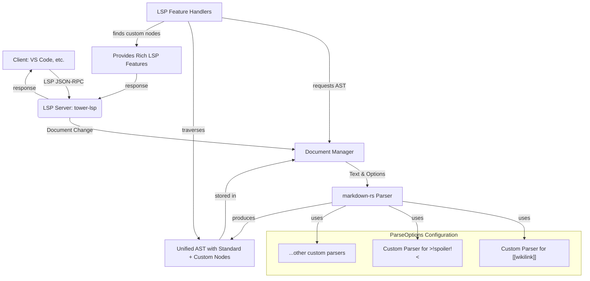

# Strategies for extending a Markdown LSP in Rust

Starting with a full-featured Markdown implementation and extending it is not only possible but is often the most practical and robust approach. It saves you from re-implementing the complexities of the CommonMark spec and extensions like GitHub Flavored Markdown (GFM).

Let's explore how to do this, focusing on the best crates and architectural patterns for this strategy.

## The Best "Full Implementation" to Start With

While `pulldown-cmark` is an excellent and complete parser for CommonMark and GFM, the crate that is specifically designed for the extension pattern you're describing is `markdown-rs`.

### Why `markdown-rs` is an ideal starting point

1. Public, First-Class AST: It parses directly into a public, immutable Abstract Syntax Tree (`markdown::ast::Node`). This is perfect for LSP features, as you can easily traverse and inspect the document structure.
2. Built-in Extension Points: Its API is designed around `markdown::ParseOptions`, which allows you to plug in custom parsers for specific constructs. This is the "holy grail" of extensibility.
3. Performance: It's written in Rust and is highly performant, using a similar event-based parsing strategy internally before constructing the AST.

You would still use `tower-lsp`, `tokio`, `ropey`, etc., for the LSP server itself, but `markdown-rs` would replace `pulldown-cmark` as the core parsing engine.

---

## Strategy 1: The Plugin/Extension Point Approach (Recommended)

This is the cleanest method, leveraging the built-in extension capabilities of `markdown-rs`. You define your new syntax and how it should be parsed, and the library seamlessly integrates it into the main parsing process.

### How it Works

1. **Define a Custom AST Node:** Create an enum variant that represents your new syntax element.
2. **Write a Custom Parser Function:** This function will be responsible for recognizing your syntax at a specific point in the text and returning a corresponding AST node if successful.
3. **Register the Parser:** Add your parser function to the `markdown::ParseOptions` configuration.
4. **Parse and Use:** The main `markdown::to_mdast` function will now automatically use your custom parser. The resulting AST will contain your custom nodes, which your LSP handlers can then easily identify.

#### Example: Adding a `[[wikilink]]` Feature

Let's add a new syntax for wiki-style links, like `[[Page Name]]`.

**Step 1: Define the Custom AST Node (Conceptual)**

`markdown-rs`'s AST is generic, but you can represent your custom node by its properties. The library handles the node creation; you just provide the logic.

**Step 2: Write the Custom Parser**

```rust
use markdown::{mdast::Node, Options, ParseOptions, Point, Result};
use markdown::tokenizer::{Tokenizer, Token};

// A custom parser function for `[[wikilink]]`
fn parse_wikilink(
    tokenizer: &mut Tokenizer,
    byte_offset: usize, // Current position in the input
    point_offset: Point, // Current line/column position
) -> Result<Option<(Node, usize, Point)>> {
    // 1. Check if we're at the start of a wikilink: `[[`
    if tokenizer.current() != Some(&b'[') || tokenizer.peek() != Some(&b'[') {
        return Ok(None);
    }

    tokenizer.consume(2); // Consume `[[`

    let mut link_text = String::new();
    let start_point = point_offset;

    // 2. Parse the content until `]]`
    while let Some(byte) = tokenizer.current() {
        if *byte == b']' && tokenizer.peek() == Some(&b']') {
            tokenizer.consume(2); // Consume `]]`

            // 3. Create a Link node, which is a standard node type
            let node = Node::Link(markdown::mdast::Link {
                children: vec![Node::Text(markdown::mdast::Text {
                    value: link_text.clone(),
                    position: Some(markdown::mdast::Position {
                        start: start_point,
                        // ... calculate end position
                    }),
                })],
                url: format!("/wiki/{}", link_text.replace(' ', "_")),
                title: None,
                position: Some(markdown::mdast::Position {
                    start: start_point,
                    // ... calculate end position
                }),
            });

            let end_point = tokenizer.point(); // New position after consuming `]]`
            return Ok(Some((node, byte_offset + link_text.len() + 4, end_point)));
        }
        link_text.push(*byte as char);
        tokenizer.consume(1);
    }

    // If we reach the end of the file without `]]`, it's not a valid wikilink.
    // Revert the state.
    tokenizer.rewind(byte_offset, point_offset);
    Ok(None)
}
```

**Step 3: Register and Use in the LSP Server**

```rust
use markdown::{to_mdast_with_options, Options, ParseOptions};
use tower_lsp::lsp_types::*;

// In your LSP `Backend` struct...
struct Backend {
    client: tower_lsp::Client,
    // ... other fields
    parse_options: ParseOptions<'static>,
}

impl Backend {
    fn new(client: tower_lsp::Client) -> Self {
        let mut parse_options = ParseOptions::default();

        // Register our custom parser for the "text" construct type.
        // This means it will be tried whenever text is expected.
        // You can be more specific with the construct type.
        parse_options.constructs.text = Some(Box::new(parse_wikilink));

        Self {
            client,
            parse_options,
        }
    }

    async fn parse_document(&self, text: &str) -> Option<Node> {
        to_mdast_with_options(text, &Options {
            parse: Some(self.parse_options),
            ..Options::default()
        }).ok()
    }

    // In your `did_open` or `did_change` handler...
    async fn did_open(&self, params: DidOpenTextDocumentParams) {
        let text = params.text_document.text;
        if let Some(ast) = self.parse_document(&text) {
            // Store the AST for LSP features
            self.document_manager.store_ast(params.text_document.uri, ast);
        }
    }

    // In your completion handler...
    async fn completion(&self, params: CompletionParams) -> Result<Option<CompletionResponse>> {
        let uri = params.text_document_position.text_document.uri;
        let pos = params.text_document_position.position;

        if let Some(ast) = self.document_manager.get_ast(&uri) {
            // Walk the AST to find the node at the cursor position
            if let Some(node) = find_node_at_position(&ast, pos) {
                // Check if it's our custom wikilink
                if let Node::Link(link) = node {
                    if link.url.starts_with("/wiki/") {
                        // Provide completions for known wiki pages
                        return Ok(Some(CompletionResponse::Array(vec![
                            CompletionItem {
                                label: "HomePage".into(),
                                kind: Some(CompletionItemKind::REFERENCE),
                                ..Default::default()
                            },
                            // ... more completions
                        ])));
                    }
                }
            }
        }
        Ok(None)
    }
}
```

---

## Strategy 2: The Pre-processor Approach

This is a more generic strategy that works with *any* Markdown parser, including `pulldown-cmark`.

**How it Works:**

1. **Intercept Text:** Before passing the document text to the Markdown parser, run it through your own pre-processor.
2. **Transform Custom Syntax:** Convert your new syntax into standard Markdown that the existing parser already understands.
3. **Parse:** Feed the transformed text into the standard parser.
4. **Handle LSP Features:** This is the tricky part. For features like "go to definition," you need to maintain a **source map** that links positions in the transformed text back to the original text.

### Example: Adding `>!spoiler!<`

**Step 1: Pre-processor Logic**

```rust
fn preprocess_spoilers(text: &str) -> (String, Vec<SourceMap>) {
    let mut output = String::new();
    let mut source_map = Vec::new();
    // ... logic to find ">!text!<"
    // Replace it with `<details><summary>Spoiler</summary>text</details>`
    // Record the original and new ranges for the source map.
    (output, source_map)
}
```

**Step 2: In the LSP Server**

```rust
// In `did_open`...
let (processed_text, source_map) = preprocess_spoilers(&original_text);
let ast = parse_with_pulldown_cmark(&processed_text); // or any parser
// Store (ast, source_map) together.
```

**Pros:**

- Works with any parser.
- Conceptually simple.

**Cons:**

- LSP complexity: Managing source maps is difficult and error-prone. Hovering over the transformed text requires mapping the position back to the original, which can break with multi-byte characters.
- Limited interaction: Your custom feature is now "dumb" to the parser. It just sees standard HTML/Markdown, not your original semantic intent.

---

### Revised Architecture Recommendation

For your goal of building an LSP for extended Markdown, the architecture centered on `markdown-rs` and its plugin system (Strategy 1) is superior. The following diagram illustrates this architecture:



### Diagram Explanation

- **Client**: Represents the text editor or IDE (like VS Code) that communicates with the LSP server.
- **LSP Server**: The main server component built with `tower-lsp` that handles protocol communication.
- **Document Manager**: Manages document state and stores ASTs.
- **markdown-rs Parser**: The core parsing engine that uses custom parsers for extended syntax.
- **ParseOptions Configuration**: Contains all custom parsers that extend the base Markdown functionality.
- **Unified AST**: The resulting abstract syntax tree containing both standard and custom nodes.
- **LSP Feature Handlers**: Components that provide language features like completion, hover, etc.
- **Provides Rich LSP Features**: The output of language features based on custom syntax recognition.

This architecture gives you the best of both worlds:

- A Solid Foundation: You get a battle-tested, spec-compliant Markdown parser for free.
- Clean Extensibility: Adding new features is a well-defined, isolated process.
- Rich LSP Integration: Your custom features are first-class citizens in the AST, making it trivial to implement context-aware LSP functionality like hover, completion, and code actions.
