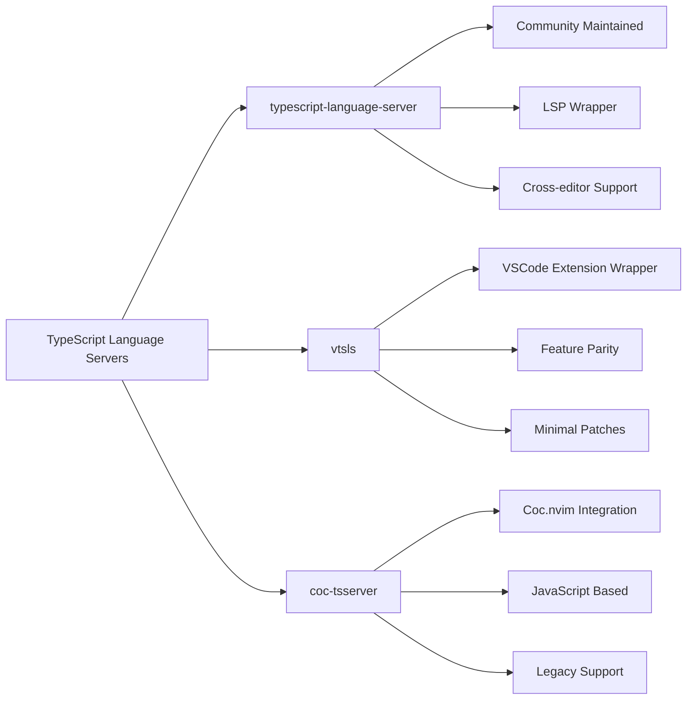

# Comprehensive Guide to TypeScript Language Servers and Supporting Web LSPs

## Introduction to Language Server Protocol (LSP) Ecosystem

The **Language Server Protocol (LSP)** has become the foundational standard for providing language intelligence in code editors and IDEs. Originally developed by Microsoft, LSP defines the protocol used between a tool (like VS Code, Sublime Text, or Neovim) and a language server that provides features like **auto complete**, **go to definition**, **find all references**, and **diagnostics** (error checking). This separation of concerns allows language support to be implemented once and reused across multiple development environments.

For TypeScript development, the LSP ecosystem has matured significantly, with several robust options available. The TypeScript compiler itself includes a **tsserver** component that provides a custom API for gathering intelligence about TypeScript/JavaScript projects, but this doesn't directly implement the standardized LSP protocol. This has led to the creation of multiple LSP implementations that bridge this gap. As of 2025, TypeScript has **surpassed Python** to become the most used programming language by contributor count on GitHub, achieving a growth rate of 66% year-over-year, which has accelerated innovation in the TypeScript tooling ecosystem.

## TypeScript Language Servers

### Primary TypeScript LSP Implementations

The TypeScript ecosystem offers several mature LSP implementations, each with distinct advantages and architectural approaches:



#### TypeScript Language Server (Community)

The **typescript-language-server** is a community-maintained project that provides a thin LSP interface on top of TypeScript's tsserver API. It aims to make TypeScript's language features available to any LSP-compliant editor.

- **Key Features**:
  - Code actions on save (organize imports, remove unused imports, fix all diagnostics)
  - Workspace commands (go to source definition, apply refactoring, organize imports)
  - Code lenses and inlay hints
  - TypeScript version notification
  - Workspace configuration for formatting settings

- **Architecture**: Delegates LSP operations (completion, diagnostics, etc.) to the tsserver from TypeScript which doesn't support LSP natively.

- **Installation**: `npm install -g typescript-language-server typescript`

- **Performance**: Generally lightweight and fast, with performance dependent on the underlying tsserver performance.

#### vtsls

**vtsls** is an LSP wrapper around the TypeScript extension bundled with VSCode, implemented by filling VSCode APIs and applying **minimal patches** to keep up with upstream updates.

- **Key Features**:
  - Nearly identical feature set and performance to VSCode's TypeScript experience
  - Supports all VSCode-specific commands and code actions
  - TypeScript version switching (between bundled and workspace versions)
  - Advanced refactoring capabilities including move to file refactoring
  - Update paths on rename functionality

- **Architecture**: Wraps VSCode's TypeScript extension rather than directly interfacing with tsserver, providing better feature parity with VSCode.

- **Installation**: `npm install -g @vtsls/language-server`

- **Performance**: Excellent performance due to leveraging Microsoft's optimized implementation, though slightly more resource-intensive than the community server.

#### CoC TSServer

**coc-tsserver** is the TypeScript language server extension for coc.nvim, providing rich language features for JavaScript and TypeScript.

- **Key Features**:
  - Seamless integration with coc.nvim ecosystem
  - Full TypeScript language feature support
  - Historical stability and maturity
  - Vim-specific optimizations

- **Architecture**: Part of the coc.nvim ecosystem, which is Node.js-based and provides a comprehensive language client framework.

- **Installation**: Available through coc.nvim's extension management system

- **Performance**: Generally performs well but requires the entire coc.nvim framework to be running, which may be heavier than native LSP implementations.

### Comparative Analysis of TypeScript LSPs

| Feature | typescript-language-server | vtsls | coc-tsserver |
|---------|---------------------------|-------|--------------|
| **Feature Parity with VSCode** | Good | Excellent | Good |
| **Performance** | Excellent | Very Good | Good |
| **Maintenance** | Community | Active Community | Stable |
| **Setup Complexity** | Low | Low | Medium (requires coc.nvim) |
| **Editor Compatibility** | All LSP editors | All LSP editors | Vim/Neovim only |
| **TypeScript Version Management** | Manual | Automatic | Manual |
| **Advanced Refactoring** | Basic | Advanced | Basic |

## HTML Language Servers

### VSCode HTML Language Server

The **vscode-html-language-server** is the official HTML language server from Microsoft, extracted from the VSCode codebase. It contains the language smarts behind the HTML editing experience of Visual Studio Code and the Monaco editor.

- **Key Features**:
  - HTML completion and suggestions
  - Attribute value completion
  - Tag closing
  - HTML validation and diagnostics
  - Document symbols and outline
  - Linked editing for matching tags

- **Installation**: Available through npm or package managers for various editors

- **Integration**: Works with any LSP-compatible editor including Neovim, Sublime Text, and Helix

### SuperHTML

**SuperHTML** is a newer HTML language server that distinguishes itself by reporting **syntax errors** in HTML, which the official VSCode HTML language server does not do.

- **Key Features**:
  - All standard HTML language features
  - Syntax error reporting and diagnostics
  - Enhanced validation capabilities
  - Modern architecture optimized for performance

- **Installation**: Available through package managers for various editors

- **Performance**: Designed to be lightweight and fast, with emphasis on accurate error detection.

## CSS Language Servers

### VSCode CSS Language Server

The **vscode-css-language-server** is Microsoft's official CSS language server, extracted from VSCode. It provides language support for CSS, LESS, and SCSS.

- **Key Features**:
  - CSS completion and suggestions
  - Property value completion
  - Color previews
  - Linting and diagnostics
  - Document symbols and outline
  - Support for CSS preprocessors (LESS, SCSS)

- **Installation**: Available through npm or package managers for various editors

- **Integration**: Works with any LSP-compatible editor

### Biome CSS Language Server

**Biome** is a fast toolchain for web projects that provides a language server for CSS alongside JavaScript, TypeScript, and JSON.

- **Key Features**:
  - CSS formatting and linting
  - 97% compatibility with Prettier formatting
  - Extremely fast performance
  - Unified toolchain for multiple web languages
  - Modern architecture with Rust implementation

- **Installation**: `npm install -g @biomejs/biome`

- **Performance**: Exceptionally fast due to Rust implementation, significantly faster than Node.js-based language servers.

## Markdown Language Servers

### Marksman

**Marksman** is a specialized language server for Markdown that provides assistance with writing and maintaining Markdown documents.

- **Key Features**:
  - Completion for Markdown syntax
  - Go to definition for links and references
  - Find references for links and images
  - Diagnostics for broken links
  - Wiki-style link support
  - Table of contents generation

- **Installation**: Available through package managers for various editors

- **Integration**: Works with any LSP-compatible editor, with specific integrations for coc.nvim

### Markdown Oxide

**Markdown Oxide** is a Personal Knowledge Management (PKM) focused Markdown language server with advanced features for organizing and navigating Markdown collections.

- **Key Features**:
  - All standard Markdown language features
  - Personal knowledge management capabilities
  - Advanced cross-referencing
  - Note organization and navigation
  - Workspace-wide search and reference finding

- **Installation**: Available through package managers for various editors

- **Performance**: Optimized for large Markdown collections and knowledge bases.

### VSCode Markdown Language Server

The **vscode-markdown-languageservice** is the language service that powers VS Code's Markdown support, extracted for reuse in other editors and tools.

- **Key Features**:
  - Document outlines
  - Workspace symbols
  - Document links
  - Smart folding
  - Smart selection
  - Preview capabilities

- **Installation**: Available through npm or package managers for various editors

- **Integration**: Works with any LSP-compatible editor, with some editors providing specific integrations.

## Setup and Configuration

### Neovim Configuration Example

For Neovim users, setting up TypeScript LSP typically involves using the built-in LSP client with nvim-lspconfig. Here's an example configuration for vtsls:

```lua
-- Enable TypeScript via the Language Server Protocol (LSP)
vim.lsp.enable('vtsls')
-- Set the TS config for the LSP
vim.lsp.config('vtsls', {
  -- Make sure this is on your path
  cmd = {'vtsls', '--stdio'},
  filetypes = {
    'javascript',
    'javascriptreact',
    'typescript',
    'typescriptreact',
    'typescript.tsx'
  },
  -- This is a hint to tell nvim to find your project root from a file within the tree
  root_dir = vim.fs.root(0, {'package.json', '.git'}),
  on_attach = on_attach,
  capabilities = capabilities,
  settings = {
    complete_function_calls = true,
    vtsls = {
      enableMoveToFileCodeAction = true,
      autoUseWorkspaceTsdk = true,
      experimental = {
        maxInlayHintLength = 30,
        completion = {
          enableServerSideFuzzyMatch = true,
        },
      },
    },
    typescript = {
      updateImportsOnFileMove = { enabled = "always" },
      suggest = {
        completeFunctionCalls = true,
      },
      inlayHints = {
        enumMemberValues = { enabled = true },
        functionLikeReturnTypes = { enabled = true },
        parameterNames = { enabled = "literals" },
        parameterTypes = { enabled = true },
        propertyDeclarationTypes = { enabled = true },
        variableTypes = { enabled = false },
      },
    },
  },
})
```

### Helix Editor Configuration

For Helix editor users, TypeScript support can be configured in the `languages.toml` file:

```toml
[language-server.typescript-language-server]
command = "typescript-language-server"
args = ["--stdio"]

[language-server.vtsls]
command = "vtsls"
args = ["--stdio"]

[[language]]
name = "typescript"
language-servers = ["vtsls"]

[[language]]
name = "tsx"
language-servers = ["vtsls"]
```

### VS Code Configuration

VS Code includes built-in support for TypeScript, HTML, and CSS through its internal language servers. For enhanced features, you can install extensions like:

- **TypeScript Importer** - for automatic import management
- **Tailwind CSS IntelliSense** - for Tailwind CSS class completion
- **Markdown All in One** - for enhanced Markdown support

## Future Directions and Emerging Trends

The TypeScript language server ecosystem is evolving rapidly, with several important trends emerging in 2025:

### TypeScript 7 Native Implementation

Microsoft is working on **TypeScript 7** written natively in the Go language that will include a built-in LSP implementation. This will hopefully supersede the current community-maintained language servers and provide better performance and reliability.

### Performance Optimizations

There's a growing focus on performance optimizations, with newer language servers like Biome leveraging Rust for exceptional speed. The traditional Node.js-based servers are also implementing various performance improvements.

### Enhanced Type Checking Features

Language servers are incorporating more advanced type checking features, including better inference, stricter checking modes, and improved error messages.

### Integrated Toolchains

There's a trend toward integrated toolchains that handle multiple languages and aspects of development. Biome is a prime example, offering formatting, linting, and language services for TypeScript, JavaScript, JSON, and CSS in a single package.

## Conclusion and Recommendations

The TypeScript LSP ecosystem has matured significantly, offering developers multiple robust options for language intelligence across different editors. The choice of language server depends on your specific needs and editor preferences:

- **For VS Code users**: The built-in TypeScript support is excellent, with no additional setup required.
- **For Neovim users**: **vtsls** offers the best feature parity with VSCode, while **typescript-language-server** is a lighter alternative.
- **For performance-critical applications**: Consider **Biome** for its exceptional speed, especially for large codebases.
- **For Markdown-heavy workflows**: **Marksman** or **Markdown Oxide** provide specialized features for document management and navigation.

The future looks bright with TypeScript 7's native LSP implementation on the horizon, which will likely standardize and improve the TypeScript language server experience across all editors. As the ecosystem continues to evolve, developers can expect even better performance, more accurate type checking, and more integrated development experiences.

**Pro Tip**: When setting up TypeScript language servers, ensure your project has a proper `package.json` or `tsconfig.json` file at the root. This helps language servers identify project boundaries and provide more accurate completions and diagnostics.
