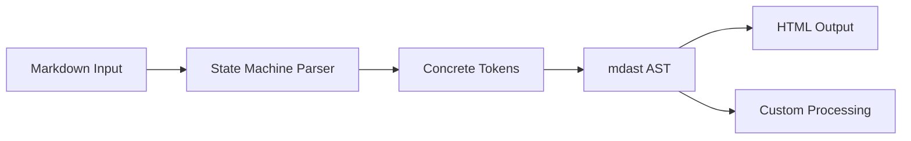
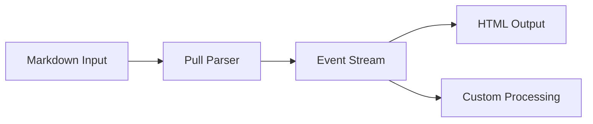

# Comprehensive Comparison: `markdown-rs` vs `pulldown-cmark` for Rust Markdown Processing

Certainly! I will provide a deep dive comparison between `markdown-rs` and `pulldown-cmark` for Rust Markdown parsing. The main contents of the report are as follows:

- **Architecture Overview**: Compares the AST-based and event-based parsing approaches.
- **Compliance & Extensions**: Analyzes CommonMark compliance and extension support.
- **Performance**: Benchmarks and memory efficiency comparison.
- **API & Ecosystem**: Developer experience and available tools.
- **Use Case Recommendations**: Guidance for different application types.

---

## 1 Introduction & Background

Markdown parsing in Rust has evolved significantly with two prominent libraries emerging as top choices for developers: **`markdown-rs`** and **`pulldown-cmark`**. Both libraries serve the fundamental purpose of converting Markdown to HTML or other formats but take distinctly different architectural approaches that impact their performance, flexibility, and suitability for various use cases. This comprehensive analysis examines their core differences, strengths, and weaknesses to help developers make informed decisions for their projects.

The **Markdown parsing landscape** in Rust has grown increasingly sophisticated as developers demand better performance, more accurate spec compliance, and richer feature sets. These two libraries represent different philosophies in Markdown parsing - `markdown-rs` focusing on **spec compliance and extensibility** through an AST-based approach, while `pulldown-cmark` prioritizes **performance and streaming processing** through its event-based architecture.[^1][^2]

## 2 Architecture & Parsing Approach

The fundamental difference between these libraries lies in their architectural approach to parsing Markdown, which significantly impacts their performance characteristics and flexibility.

### 2.1 `markdown-rs` - AST-Based Approach

`markdown-rs` implements a **state machine parser** that emits concrete tokens with positional information, which are then exposed as an **Abstract Syntax Tree (AST)** through the mdast format.[^1] This approach provides:

- **Complete syntax tree representation** that can be manipulated and analyzed
- **Positional information** for every element in the document
- **100% safe Rust implementation** with no unsafe blocks[^1]
- **`#![no_std]` compatibility** with `alloc` for embedded environments[^1]

The parsing process in `markdown-rs` follows this flow:



### 2.2 `pulldown-cmark` - Event-Based Approach

`pulldown-cmark` employs a **pull parser** that generates a stream of events rather than a full AST.[^2][^3] This design choice leads to:

- **Lower memory allocation** and copying for better performance[^2]
- **Streaming capability** that can process documents without full materialization
- **Iterator-based API** that allows for event-by-event processing
- **Zero-copy parsing** where possible through efficient string handling[^2]

The parsing process in `pulldown-cmark` follows this flow:



### 2.3 Architectural Trade-offs

The **AST-based approach** of `markdown-rs` provides more comprehensive document manipulation capabilities but requires more memory and processing. The **event-based approach** of `pulldown-cmark` offers better performance and streaming capabilities but may be less intuitive for complex document transformations.[^4][^2]

## 3 Compliance & Extensions

### 3.1 CommonMark Compliance

Both libraries aim for CommonMark compliance but achieve it through different methods:

| Library | Compliance Approach | Testing Coverage |
|---------|---------------------|------------------|
| `markdown-rs` | 100% CommonMark compliant with 2300+ tests[^1] | Extensive testing with 100% code coverage[^1] |
| `pulldown-cmark` | Goal of 100% compliance[^2] | Strong compliance but slightly less comprehensive testing |

### 3.2 Extension Support

#### 3.2.1 `markdown-rs` Extensions

`markdown-rs` provides **comprehensive extension support** including:

- **GFM (GitHub Flavored Markdown)**: 100% support for tables, strikethrough, task lists[^1]
- **MDX support**: Full MDX compilation capabilities through sibling project `mdxjs-rs`[^5]
- **Math support**: Mathematical notation rendering[^1]
- **Frontmatter**: YAML and other metadata formats[^1]
- **Custom extensions**: Well-defined extension architecture[^1]

#### 3.2.2 `pulldown-cmark` Extensions

`pulldown-cmark` supports a more limited set of extensions:

- **GFM features**: Tables, strikethrough, task lists[^2]
- **Footnotes**: Optional footnote support[^2]
- **Additional extensions**: Through ecosystem crates like `pulldown-cmark-frontmatter`[^6]

<details>
<summary>Extension Implementation Comparison</summary>

The implementation approach differs significantly between the two libraries. `markdown-rs` integrates extensions into its core architecture, while `pulldown-cmark` relies on an optional flag system and ecosystem crates for additional functionality.[^1][^2] This means `markdown-rs` provides a more cohesive extension experience, while `pulldown-cmark` offers more modularity but potentially less integration.

</details>

## 4 Performance & Efficiency

### 4.1 Benchmark Performance

While the search results don't provide direct benchmark comparisons between these two libraries, they offer insights into their performance characteristics:

- **`pulldown-cmark`**: Explicitly designed for **speed with minimal allocation and copying**.[^2] Benchmarks mentioned in the search results show it being faster than cmark (the C reference implementation) but slower than hoedown.[^7]
- **`markdown-rs`**: Focuses on **correctness and robustness** with 100% test coverage and fuzz testing,[^1] which may come with some performance overhead due to its comprehensive AST generation.

### 4.2 Memory Efficiency

The **memory efficiency** differs significantly:

- **`pulldown-cmark`**: More memory efficient due to its event-based approach that doesn't require materializing the entire document tree.[^2]
- **`markdown-rs`**: Requires more memory to maintain the complete AST but provides more comprehensive document information.[^1]

### 4.3 Processing Models

| Feature | `markdown-rs` | `pulldown-cmark` |
|---------|---------------|------------------|
| **Processing Model** | AST-based | Event-based |
| **Memory Usage** | Higher (full AST) | Lower (streaming) |
| **Streaming Support** | Limited | Excellent |
| **Backtracking** | Easier with AST | More complex |

## 5 API Design & Developer Experience

### 5.1 API Comparison

#### 5.1.1 `markdown-rs` API

The `markdown-rs` API provides **straightforward functions** for common tasks:

```rust
// Simple HTML conversion
println!("{}", markdown::to_html("## Hi, *Saturn*! 🪐"));

// With options (GFM)
markdown::to_html_with_options(
    "* [x] contact ~Mercury~Venus at hi@venus.com!",
    &markdown::Options::gfm()
)?;

// AST access
markdown::to_mdast("# Hi *Earth*!", &markdown::ParseOptions::default())?;
```

The API is designed for **simplicity and ease of use** with sensible defaults.[^1]

#### 5.1.2 `pulldown-cmark` API

The `pulldown-cmark` API provides **more control** but requires more setup:

```rust
use pulldown_cmark::{Parser, Options, html};

let mut options = Options::empty();
options.insert(Options::ENABLE_STRIKETHROUGH);
let parser = Parser::new_ext(markdown_input, options);

let mut html_output = String::new();
html::push_html(&mut html_output, parser);
```

This API offers **fine-grained control** over parsing options and processing.[^3]

### 5.2 Ecosystem & Tooling

The ecosystem around these libraries differs significantly:

#### 5.2.1 `markdown-rs` Ecosystem

- **MDX compilation**: Through `mdxjs-rs` for JavaScript/React integration[^5]
- **JavaScript sibling**: `micromark` for cross-platform compatibility[^1]
- **Comprehensive tooling**: Well-documented APIs with extensive examples[^1]

#### 5.2.2 `pulldown-cmark` Ecosystem

- **Rustdoc integration**: Used in Rust's documentation system[^8]
- **Specialized crates**:
  - `pulldown-cmark-to-cmark` for converting events back to Markdown[^9]
  - `pulldown-cmark-frontmatter` for frontmatter extraction[^6]
  - `pulldown-cmark-toc` for table of contents generation[^10]
  - `highlight-pulldown` for syntax highlighting[^11]

## 6 Use Case Recommendations

Based on the analysis, here are recommendations for specific use cases:

### 6.1 Choose `markdown-rs` When

- **MDX support is required**: For projects that need to compile MDX to JavaScript[^5]
- **Maximum spec compliance is critical**: When 100% CommonMark and GFM compliance is non-negotiable[^1]
- **Complex document manipulation**: When you need to analyze or transform the document structure extensively[^1]
- **JavaScript ecosystem integration**: When working with tools like `micromark` in JavaScript environments[^1]
- **Mathematical content**: When math support is required[^1]

### 6.2 Choose `pulldown-cmark` When

- **Performance is critical**: When processing large documents or high-throughput applications[^2]
- **Streaming processing is needed**: When you need to process documents without full materialization[^2]
- **Memory efficiency is important**: When working in memory-constrained environments[^2]
- **Rustdoc compatibility**: When building tools that need to match Rust's documentation output[^8]
- **Custom processing pipelines**: When you need to build custom transformations on the event stream[^4]

### 6.3 Use Case Comparison Table

| Use Case | Recommended Library | Rationale |
|----------|---------------------|-----------|
| **Static Site Generation** | `pulldown-cmark` | Better performance for processing many documents |
| **Documentation Generation** | `pulldown-cmark` | Compatibility with Rustdoc and proven in that context |
| **MDX Processing** | `markdown-rs` | Native MDX support through `mdxjs-rs`[^5] |
| **Content Management Systems** | `markdown-rs` | Better document manipulation capabilities through AST |
| **Real-time Markdown Preview** | `pulldown-cmark` | Streaming support for incremental updates |
| **Academic/Technical Writing** | `markdown-rs` | Math support and extensive compliance[^1] |

## 7 Future Development & Roadmap

### 7.1 `markdown-rs` Development

Based on the search results, `markdown-rs` appears to be focusing on:

- **Plugin architecture**: There's ongoing discussion about enabling custom plugins[^4]
- **Performance optimization**: While maintaining correctness as the priority[^1]
- **Extension ecosystem**: Continuing to build out extension support[^1]

### 7.2 `pulldown-cmark` Development

`pulldown-cmark` appears to be focusing on:

- **Performance improvements**: Continued optimization for speed[^2]
- **Spec compliance**: Maintaining and improving CommonMark compliance[^2]
- **Ecosystem growth**: Supporting the growing ecosystem of specialized crates[^9][^6][^10]

## 8 Conclusion

Both `markdown-rs` and `pulldown-cmark` are excellent choices for Markdown parsing in Rust, but they serve different needs:

- **`markdown-rs`** excels in **spec compliance, extension support, and document manipulation** through its AST-based approach. It's the better choice for applications that need comprehensive Markdown processing, especially with MDX or mathematical content.[^1][^5]

- **`pulldown-cmark`** excels in **performance, memory efficiency, and streaming processing** through its event-based approach. It's the better choice for performance-critical applications or when processing large documents.[^2][^3]

The choice between them should be based on your specific requirements: if you need maximum compliance and extension support, choose `markdown-rs`; if you need maximum performance and streaming capabilities, choose `pulldown-cmark`. Both libraries are actively maintained and have strong communities supporting their development.

<details>
<summary>Implementation Example: Syntax Highlighting</summary>

The difference in architecture becomes apparent when implementing features like syntax highlighting. With `pulldown-cmark`, you can efficiently process the event stream and inject syntax highlighting during HTML generation:[^11]

```rust
// pulldown-cmark approach
let parser = Parser::new_ext(markdown, Options::empty());
let events = parser.map(|event| {
    match event {
        Event::Code(code) => {
            // Apply syntax highlighting to code blocks
            Event::Html(format!("<code class=\"highlighted\">{}</code>", code).into())
        }
        _ => event
    }
});
let mut html = String::new();
html::push_html(&mut html, events);
```

With `markdown-rs`, you would typically work with the AST after parsing:

```rust
// markdown-rs approach
let ast = markdown::to_mdast(markdown, &ParseOptions::default())?;
// Transform the AST to add syntax highlighting
let transformed_ast = transform_ast_for_highlighting(ast);
let html = markdown::to_html_with_options(
    &transformed_ast,
    &CompileOptions::default()
)?;
```

The `pulldown-cmark` approach is generally more efficient for this use case as it avoids materializing the full AST.[^4][^11]

</details>

---

## References

[^1]: markdown-rs crate documentation and README
[^2]: pulldown-cmark crate documentation and README
[^3]: pulldown-cmark API documentation
[^4]: Discussion on markdown-rs plugin architecture
[^5]: mdxjs-rs project for MDX compilation
[^6]: pulldown-cmark-frontmatter crate
[^7]: Performance benchmarks comparing Rust Markdown parsers
[^8]: Rustdoc integration with pulldown-cmark
[^9]: pulldown-cmark-to-cmark crate
[^10]: pulldown-cmark-toc crate
[^11]: highlight-pulldown crate for syntax highlighting
