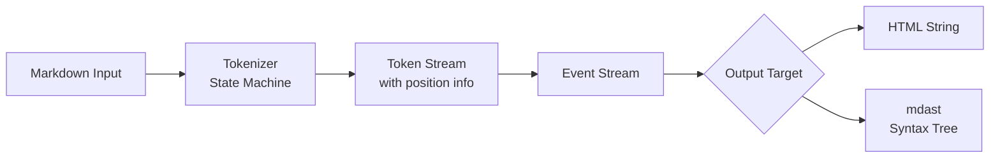

# The `markdown-rs` Crate

The `markdown-rs` crate is a robust, CommonMark-compliant Markdown parser for Rust. Its architecture is built around a state machine that processes every byte of input, producing tokens and an Abstract Syntax Tree (AST), which makes it both reliable and versatile for various applications.

## Architecture and Processing Pipeline

At its core, `markdown-rs` is a **state machine** (`#![no_std] + alloc`) designed to produce concrete tokens with positional information from every byte of input. This token stream is then processed into higher-level formats.

The following diagram illustrates the main stages of this pipeline:



The pipeline begins with the **tokenizer**, which uses the state machine to convert raw markdown into a token stream. These tokens are then transformed into an **event stream** (`event.rs`), representing meaningful actions (like "start of a paragraph").

A key component is the **`mdast` (Markdown AST)**. This syntax tree, defined in `mdast.rs`, provides a structured, hierarchical representation of the document (headings, lists, text nodes, etc.), which is easier for programmatic analysis and manipulation than raw text or HTML.

You can target different outputs. The `to_html` modules compile events directly to an HTML string. Alternatively, `to_mdast` transforms events into the `mdast` syntax tree.

## Standards Compliance: CommonMark and GFM

`markdown-rs` emphasizes strict compliance with standards. It is tested against approximately 650 CommonMark specification tests and over 1,000 additional tests confirmed against the official reference parsers (`cmark`, `cmark-gfm`).

For **GitHub Flavored Markdown (GFM)**, the crate supports extensions like tables, task lists, strikethrough, and autolinks. These features are not enabled by default but can be activated through configuration options.

## Usage Patterns and Core API

The public API is centered on three main functions, with configuration allowing granular control.

### Basic HTML Generation

The simplest way to use the crate is to convert Markdown directly to safe HTML. By default, it protects against XSS attacks by encoding or dropping dangerous HTML and protocols.

```rust
use markdown::to_html;

let html = to_html("# Hello, *world*!");
assert_eq!(html, "<h1>Hello, <em>world</em>!</h1>\n");
```

### Configurable Parsing and Compiling

For more control, use `to_html_with_options`. You can enable GFM extensions, allow dangerous content (with caution), or disable specific constructs.

```rust
use markdown::{to_html_with_options, CompileOptions, Constructs, Options, ParseOptions};

// Configure to enable GFM extensions like tables and task lists
let options = Options {
    parse: ParseOptions {
        constructs: Constructs::gfm(),
        ..ParseOptions::default()
    },
    compile: CompileOptions::default(),
};

let markdown = "| Heading |\n| ------- |\n| Cell    |";
let html = to_html_with_options(markdown, &options).unwrap();
```

### Working with the Syntax Tree (AST)

For analysis or complex manipulation, parse Markdown into an `mdast` syntax tree using `to_mdast`.

```rust
use markdown::to_mdast;

let ast = to_mdast("# Title\n\nA paragraph.", &markdown::ParseOptions::default()).unwrap();
println!("{:#?}", ast); // Inspect the tree structure
```

## Practical Use Cases and Examples

`markdown-rs` is suitable for various applications, from simple rendering to complex document processing.

### Use Case 1: Safe Rendering in Web Applications

This is the most common use case. You can securely render user-generated content, such as blog comments or documentation.

```rust
use markdown::{to_html_with_options, CompileOptions, Options, ParseOptions};

/// Renders user-provided markdown to safe HTML for web display.
fn render_user_content(markdown_input: &str) -> String {
    // Use default safe options: dangerous HTML and protocols are disallowed.
    let options = Options::default();
    to_html_with_options(markdown_input, &options).unwrap() // Result is safe for embedding.
}
```

### Use Case 2: Document Analysis and Transformation

By working with the AST, you can build tools that analyze or modify document structure, like extracting all links or linting for style rules.

```rust
use markdown::{to_mdast, mdast::{Node, Link}};
use std::collections::HashSet;

/// Extracts all unique link URLs from a markdown document.
fn extract_all_links(markdown_input: &str) -> HashSet<String> {
    let ast = to_mdast(markdown_input, &markdown::ParseOptions::default()).unwrap();
    let mut links = HashSet::new();
    // A helper function to walk the AST nodes
    fn walk_for_links(node: &Node, set: &mut HashSet<String>) {
        match node {
            Node::Link(Link { url, .. }) => {
                set.insert(url.clone());
            }
            // Recursively walk children of any node
            _ => {
                if let Some(children) = node.children() {
                    for child in children {
                        walk_for_links(child, set);
                    }
                }
            }
        }
    }
    walk_for_links(&ast, &mut links);
    links
}
```

### Use Case 3: Building GitHub-Flavored Tools

For platforms that need to match GitHub's readme rendering, you can configure the parser accordingly.

```rust
use markdown::{to_html_with_options, Constructs, Options, ParseOptions};

/// Renders markdown exactly as GitHub would for a README.
fn render_like_github(markdown_input: &str) -> String {
    let options = Options {
        parse: ParseOptions {
            constructs: Constructs::gfm(), // Enable tables, tasklists, etc.
            ..ParseOptions::default()
        },
        ..Options::default()
    };
    to_html_with_options(markdown_input, &options).unwrap()
}
```

### Important Consideration: Extending the Parser

A known limitation is that `markdown-rs` does not have an official, stable plugin system for adding new syntax. As noted in discussions, the extensibility needed is challenging in Rust's type system. If you need a custom flavor, the suggested approach is to create a **new parser that delegates to `markdown-rs` internals**, reusing its core functionality rather than forking the repository.

## Comparison and Ecosystem Position

Understanding how `markdown-rs` compares to other popular crates can help in selecting the right tool.

| **Crate** | **Primary Approach** | **Key Strength** | **Notable Feature** |
| :--- | :--- | :--- | :--- |
| **`markdown-rs`** | State machine -> Tokens -> AST/HTML | **Spec compliance & safety** | Reference parser alignment, secure by default. |
| **`pulldown-cmark`** | Pull parser/event streaming | **High performance** | Fast, streaming operation; used in `rustdoc`. |
| **`comrak`** | Port of `cmark-gfm` (C to Rust) | **GFM fidelity** | Renders exactly like GitHub; used by `docs.rs`. |
| **`markdown-ast`** | Interoperability layer | **AST usability** | Focuses on a friendly AST that works with `pulldown-cmark` events. |

`markdown-rs` distinguishes itself with its **security-first design** and **comprehensive compliance**. It is an excellent choice when spec correctness and safe handling of untrusted input are priorities.

## Summary and Recommendations

To summarize, here are some key takeaways and recommendations for using `markdown-rs`:

- **For most web rendering**: Use `to_html` or `to_html_with_options` with default settings. It's secure and compliant.
- **For document analysis or transformation**: Use `to_mdast` to obtain the syntax tree and walk or modify it as needed.
- **For GitHub-compatible rendering**: Configure the parser with `Constructs::gfm()`.
- **If you need custom syntax**: Be aware that creating extensions is non-trivial. Consider the delegation pattern or evaluate if `markdown-it.rs` (which has a plugin system but less complete GFM support) fits your needs.
