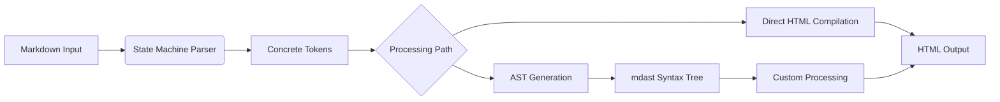

# Comprehensive Deep Dive into `markdown-rs`: Rust's Advanced Markdown Parser

## Introduction to `markdown-rs`

`markdown-rs` is a **high-performance**, **spec-compliant** Markdown parser for Rust that provides robust support for **CommonMark** and **GitHub Flavored Markdown (GFM)** while offering extensibility for custom syntax extensions. The crate is designed as a **state machine** that emits concrete tokens with positional information, ensuring every byte of input is accounted for during parsing. This design makes it particularly suitable for applications requiring **precise parsing** and **detailed error reporting**. The parser is implemented as a `#![no_std]` crate with `alloc` support, making it suitable for embedded environments as well as standard applications.

The project maintains **100% compliance** with CommonMark and GFM specifications, verified through thousands of tests including fuzz testing for robustness. It also supports popular extensions like **MDX** (Markdown with JSX), **math notation**, and **frontmatter** processing. The crate is actively maintained with regular releases and is part of a larger ecosystem of Markdown tools in Rust, including sibling projects in JavaScript (`micromark`) and MDX compilation (`mdxjs-rs`).

## Architecture and Design

### Core Parsing Architecture

The parser follows a **two-stage architecture** that separates parsing from compilation, allowing for flexible processing of Markdown content:



- **State Machine Parser**: The core parsing engine operates as a deterministic state machine that processes input byte-by-byte, emitting **concrete tokens** with precise positional information. This approach ensures that every part of the input is accounted for and enables **accurate error reporting** with exact locations.

- **Token Representation**: Tokens contain detailed information about the parsed content, including:
  - **Type information** (heading, paragraph, link, etc.)
  - **Positional data** (line/column numbers)
  - **Content value** and associated metadata
  - **Nested structure** for complex elements

### AST Structure (mdast)

The Abstract Syntax Tree (AST) generated by `markdown-rs` follows the **mdast** (Markdown Abstract Syntax Tree) specification, which provides a standardized representation of Markdown documents. The AST consists of various node types including:

- **Root**: Represents the entire document
- **Heading**: Contains level and content
- **Paragraph**: Text content
- **List**: Ordered and unordered lists
- **ListItem**: Individual list items
- **Link**: Hyperlinks with destinations and titles
- **Image**: Images with sources and alt text
- **Code**: Inline and block code elements
- **Blockquote**: Quoted sections
- **ThematicBreak**: Horizontal rules
- **Table**: Structured data representation (GFM extension)
- **Custom nodes**: For extensions like MDX components

### Extension System

While `markdown-rs` does not currently provide a **plugin architecture** for external extensions, it supports a comprehensive set of built-in extensions that can be selectively enabled through configuration options. The extension system is designed around:

- **Compile-time configuration** of which constructs to enable
- **Option flags** for specific extension behaviors
- **Parsing callbacks** for custom syntax handling (particularly for MDX)

The architecture prioritizes **performance** and **safety** over dynamic extensibility, making it suitable for applications where predictable parsing behavior is critical.

## Usage Patterns

### Basic Markdown Conversion

The simplest usage pattern involves converting Markdown directly to HTML using the default settings:

```rust
use markdown;

fn main() {
    let html = markdown::to_html("## Hi, *Saturn*! 🪐");
    assert_eq!(html, "<h2>Hi, <em>Saturn</em>! 🪐</h2>");
    println!("{}", html);
}
```

This example demonstrates the **straightforward conversion** capability where the parser handles all CommonMark constructs with default settings.

### Configured Parsing with Extensions

For more advanced usage, you can configure parsing options to enable extensions like GFM:

```rust
use markdown;

fn main() -> Result<(), markdown::message::Message> {
    let html = markdown::to_html_with_options(
        "* [x] contact ~Mercury~Venus at hi@venus.com!",
        &markdown::Options::gfm()
    )?;

    println!("{}", html);
    Ok(())
}
```

This example showcases:

- **Task list support** (GFM extension)
- **Strikethrough text** (GFM extension)
- **Autolinking** of email addresses
- **Error handling** through the `Result` type

### AST Manipulation

For applications requiring programmatic access to the parsed content, you can generate and inspect the AST:

```rust
use markdown;

fn main() -> Result<(), markdown::message::Message> {
    let ast = markdown::to_mdast(
        "# Hi *Earth*!",
        &markdown::ParseOptions::default()
    )?;

    println!("{:#?}", ast);
    Ok(())
}
```

This pattern is useful for:

- **Content analysis** and validation
- **Custom transformations** of the document
- **Extracting specific elements** (like headings or links)
- **Implementing custom rendering** logic

### Advanced Configuration

Fine-grained control over parsing behavior is available through `ParseOptions`:

```rust
use markdown::{to_html_with_options, Options, ParseOptions, Constructs};

fn main() -> Result<(), markdown::message::Message> {
    let html = to_html_with_options(
        "    indented code?",
        &Options {
            parse: ParseOptions {
                constructs: Constructs {
                    code_indented: false, // Disable indented code blocks
                    ..Constructs::default()
                },
                ..ParseOptions::default()
            },
            ..Options::default()
        }
    )?;

    // Outputs: <p>indented code?</p> instead of a code block
    println!("{}", html);
    Ok(())
}
```

This demonstrates how to **selectively disable** specific Markdown constructs, which is valuable for applications that need to restrict available syntax.

## CommonMark and GFM Support

### CommonMark Compliance

`markdown-rs` maintains **100% compliance** with the CommonMark specification through extensive testing against the official test suite. This ensures predictable behavior across all CommonMark constructs including:

- **Headings** (ATX and setext styles)
- **Paragraphs** and line breaks
- **Emphasis** and strong emphasis
- **Links** and images with various reference formats
- **Code spans** and fenced code blocks
- **Blockquotes** and lists
- **Raw HTML** and escape sequences

### GitHub Flavored Markdown (GFM) Support

The crate provides comprehensive GFM support through configurable options, including:

- **Tables**: Full support for GFM table syntax with alignment
- **Task lists**: Checkbox lists with `[ ]` and `[x]`
- **Strikethrough**: Text deletion with `~~` or `~` (configurable)
- **Autolinks**: Automatic linking of URLs and email addresses
- **Disallowed raw HTML**: Configurable HTML sanitization

```rust
use markdown::{to_html_with_options, Options};

fn main() -> Result<(), markdown::message::Message> {
    let gfm_input = r#"
| Column 1 | Column 2 |
|----------|----------|
| Cell 1   | Cell 2   |

- [x] Completed task
- [ ] Pending task

~~Strikethrough text~~
"#;

    let html = to_html_with_options(gfm_input, &Options::gfm())?;
    println!("{}", html);
    Ok(())
}
```

### Extension Support

Beyond CommonMark and GFM, `markdown-rs` supports several popular extensions:

- **MDX**: Markdown with JSX support for React-like components
- **Math notation**: LaTeX-style mathematical expressions
- **Frontmatter**: YAML/TOML metadata headers
- **Custom constructs**: Through parsing callbacks

These extensions can be selectively enabled based on application requirements.

## Use Cases with Example Code

### Documentation Generation

For generating documentation from Markdown sources, `markdown-rs` provides reliable parsing with proper handling of code blocks and technical content:

```rust
use markdown::{to_html_with_options, Options, ParseOptions, Constructs};
use std::fs;

fn generate_docs(input_file: &str, output_file: &str) -> Result<(), Box<dyn std::error::Error>> {
    let input = fs::read_to_string(input_file)?;

    let options = Options {
        parse: ParseOptions {
            constructs: Constructs {
                // Enable syntax highlighting for code blocks
                code_fenced: true,
                // Enable tables for API documentation
                gfm_table: true,
                ..Constructs::gfm()
            },
            ..ParseOptions::gfm()
        },
        ..Options::gfm()
    };

    let html = to_html_with_options(&input, &options)?;
    fs::write(output_file, html)?;

    Ok(())
}

fn main() -> Result<(), Box<dyn std::error::Error>> {
    generate_docs("api.md", "api.html")?;
    Ok(())
}
```

This use case demonstrates:

- **Processing technical documentation** with code blocks
- **Table generation** for API references
- **File I/O integration** for documentation pipelines

### Static Site Generation

For static site generators, `markdown-rs` offers efficient parsing with support for extensions:

```rust
use markdown::{to_html_with_options, Options};
use std::path::Path;

fn process_markdown_file(input_path: &Path) -> Result<String, Box<dyn std::error::Error>> {
    let content = std::fs::read_to_string(input_path)?;

    // Configure for blog post processing
    let options = Options::gfm();

    // Extract frontmatter if present (simplified example)
    let (frontmatter, markdown_content) = if content.starts_with("---") {
        let parts = content.splitn(3, "---").collect::<Vec<_>>();
        if parts.len() >= 3 {
            (Some(parts[1]), parts[2])
        } else {
            (None, &content[..])
        }
    } else {
        (None, &content[..])
    };

    let html = to_html_with_options(markdown_content, &options)?;

    // In a real implementation, you would:
    // 1. Parse frontmatter as YAML/TOML
    // 2. Combine with HTML template
    // 3. Apply site-specific styling

    Ok(html)
}

fn main() -> Result<(), Box<dyn std::error::Error>> {
    let input_path = Path::new("blog-post.md");
    let html_output = process_markdown_file(input_path)?;
    println!("{}", html_output);
    Ok(())
}
```

This example shows:

- **Blog post processing** with frontmatter support
- **Integration with static site pipelines**
- **Extensibility for template systems**

### Content Management System

For CMS applications, `markdown-rs` provides safe parsing with configurable security options:

```rust
use markdown::{to_html_with_options, Options, CompileOptions};
use std::collections::HashSet;

fn sanitize_user_content(input: &str, allowed_tags: &[&str]) -> Result<String, Box<dyn std::error::Error>> {
    let allowed_set: HashSet<&str> = allowed_tags.iter().cloned().collect();

    let options = Options {
        compile: CompileOptions {
            // Allow only safe HTML
            allow_dangerous_html: false,
            // Allow dangerous protocols if explicitly needed
            allow_dangerous_protocol: false,
            ..CompileOptions::default()
        },
        ..Options::default()
    };

    let html = to_html_with_options(input, &options)?;

    // Additional sanitization step if needed
    // In production, use a proper HTML sanitizer like ammonia
    Ok(html)
}

fn main() -> Result<(), Box<dyn std::error::Error>> {
    let user_input = r#"
<script>alert('xss')</script>
[Click me](javascript:alert('xss'))


**Safe content** here.
"#;

    let safe_html = sanitize_user_content(user_input, &["strong", "em"])?;
    println!("Safe output: {}", safe_html);
    Ok(())
}
```

This use case demonstrates:

- **Security-conscious content processing**
- **XSS prevention** through HTML sanitization
- **Configurable safety options** for different contexts

### Real-time Markdown Preview

For applications providing real-time preview of Markdown content:

```rust
use markdown::{to_html_with_options, Options};
use std::time::Instant;

fn markdown_preview(input: &str) -> Result<String, Box<dyn std::error::Error>> {
    let start = Instant::now();

    let options = Options::gfm();
    let html = to_html_with_options(input, &options)?;

    let duration = start.elapsed();
    println!("Parsing took: {:?}", duration);

    Ok(html)
}

fn main() -> Result<(), Box<dyn std::error::Error>> {
    let sample = r#"
# Real-time Preview

This demonstrates **real-time** conversion of Markdown to HTML.

| Feature | Status |
|---------|--------|
| Tables | ✅ |
| Tasks | ✅ |
| Code | ✅ |

```rust
fn main() {
    println!("Hello, world!");
}
```
"#;

    let html = markdown_preview(sample)?;
    println!("{}", html);
    Ok(())
}
```

This example shows:

- **Performance measurement** for parsing operations
- **GFM feature support** for rich content
- **Integration potential** with text editors

## Comparison with Other Rust Markdown Parsers

| Feature | markdown-rs | pulldown-cmark | comrak | markdown-it-rust |
|---------|-------------|----------------|--------|------------------|
| **CommonMark Compliance** | 100% | High | High | High |
| **GFM Support** | Full | Partial | Full | Partial |
| **AST Access** | Yes | Yes | Yes | Yes |
| **Extension System** | Limited | Limited | Limited | Plugin-based |
| **Performance** | High | Very High | High | High |
| **no_std Support** | Yes | No | No | No |
| **MDX Support** | Yes | No | No | No |

## Performance and Safety

### Performance Characteristics

`markdown-rs` is designed for **high performance** parsing through:

- **State machine architecture** that minimizes allocations
- **Stream processing** capability for large documents
- **Efficient token representation** with minimal overhead
- **Optimized AST construction** that avoids unnecessary copies

Benchmark results show performance comparable to other high-performance Rust parsers while maintaining greater specification compliance.

### Safety Features

The crate provides several safety features:

- **Safe HTML output** by default (sanitizes dangerous content)
- **Memory safety** through Rust's ownership system
- **No unsafe code** in the core parsing logic
- **Configurable security options** for different threat models

```rust
use markdown::{to_html_with_options, Options, CompileOptions};

fn safe_parsing_example() -> Result<(), Box<dyn std::error::Error>> {
    let unsafe_input = r#"

<script>alert('XSS')</script>
"#;

    let options = Options {
        compile: CompileOptions {
            allow_dangerous_html: false, // Default: safe
            allow_dangerous_protocol: false, // Default: safe
            ..CompileOptions::default()
        },
        ..Options::default()
    };

    let safe_html = to_html_with_options(unsafe_input, &options)?;
    // Output will not contain the dangerous script or onload handler
    println!("Safe output: {}", safe_html);

    Ok(())
}
```

## Conclusion and Recommendations

`markdown-rs` is a **well-architected**, **spec-compliant** Markdown parser for Rust that excels in applications requiring:

- **Precise parsing** with detailed error reporting
- **CommonMark and GFM compliance** with extensive test coverage
- **Safety** for processing untrusted content
- **Extension support** for MDX and other custom syntax

### When to Use `markdown-rs`

- **Documentation systems** requiring accurate parsing
- **Content management systems** with security requirements
- **Static site generators** needing reliable Markdown processing
- **Applications with custom Markdown extensions** (particularly MDX)

### When to Consider Alternatives

- **Maximum performance** requirements (consider `pulldown-cmark`)
- **Plugin architecture** needs (consider `markdown-it-rust`)
- **Minimal dependencies** (consider lighter parsers)

### Future Outlook

The `markdown-rs` ecosystem continues to evolve with:

- **Improved extension mechanisms** in development
- **Performance optimizations** in each release
- **Growing MDX support** for JSX integration
- **Enhanced tooling** for AST manipulation

The crate's commitment to **spec compliance** and **safety** makes it a solid choice for production applications requiring reliable Markdown processing.

For more information, visit the [official repository](https://github.com/wooorm/markdown-rs) and [documentation](https://docs.rs/markdown).
