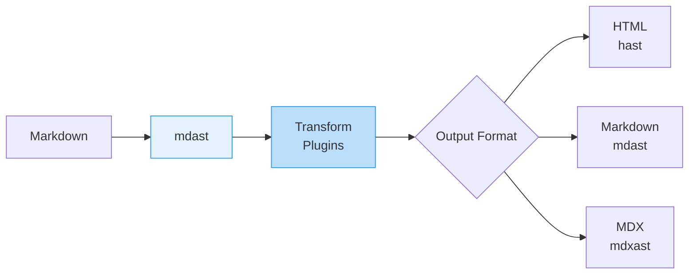

# Comprehensive Deep Dive into mdast: Features, AST Nodes, and Ecosystem Momentum

## Introduction to mdast

**mdast** (Markdown Abstract Syntax Tree) is a **formal specification** for representing markdown documents as an abstract syntax tree (AST). It provides a structured, programmatic way to parse, analyze, transform, and serialize markdown content. mdast is part of the **unified collective**—a collection of interoperating tools and specifications for processing content through syntax trees. mdast extends **unist** (Universal Syntax Tree), which provides the foundational interface for all syntax trees in the ecosystem.

The development of mdast began in July 2014 as part of the **remark** project, before unist existed. Today, it serves as the backbone for markdown processing across numerous JavaScript tools and has implementations in other programming languages as well. mdast can represent various markdown flavors including **CommonMark** and **GitHub Flavored Markdown (GFM)**, making it highly versatile for different documentation needs.

## Core Features of mdast

### Extensibility and Modularity

mdast is designed with **extensibility** at its core. While the base specification covers standard markdown elements, it can be extended through additional specifications and utilities to support:

- **Directives and roles** (e.g., admonitions, citations, equations) following existing standards where defined
- **GitHub Flavored Markdown (GFM)** extensions like autolink literals, footnotes, strikethrough, and tables through mdast-util-gfm
- **Frontmatter** support for metadata embedding (YAML, TOML, etc.)
- **MDX** integration for JSX components within markdown

This extensibility allows mdast to evolve alongside markdown's capabilities while maintaining backward compatibility.

### Serialization and Interoperability

mdast trees are **serializable to JSON or YAML**, making them easy to share between projects, languages, and implementations. This serialization capability enables:

- **Persistent storage** of parsed markdown documents
- **Cross-language compatibility** for processing markdown in different environments
- **Version control** of AST structures for testing and validation
- **Transportability** between different tools in the unified ecosystem

### TypeScript Support

For TypeScript users, mdast provides comprehensive type definitions available through **@types/mdast** package. This enables:

- **Type-safe AST manipulation** with full IntelliSense support
- **Compile-time validation** of node structures and transformations
- **Enhanced developer experience** with precise type checking

## mdast AST Nodes

The mdast specification defines a hierarchical structure of nodes that represent markdown elements. These nodes are categorized into abstract interfaces (base types) and concrete implementations (specific elements).

### Abstract Node Interfaces

mdast defines two primary abstract interfaces that other nodes inherit from:

```typescript
// Literal interface for nodes containing a value
interface Literal extends UnistLiteral {
  value: string
}

// Parent interface for nodes containing other nodes
interface Parent extends UnistParent {
  children: MdastContent[]
}
```

### Concrete Node Types

The mdast specification includes numerous concrete node types representing markdown elements. Below is a comprehensive classification of these nodes:

| **Category** | **Node Type** | **Description** | **Interface** |
|--------------|---------------|-----------------|---------------|
| **Document** | `Root` | Root node of the document | Parent |
| **Headings** | `Heading` | Heading content (levels 1-6) | Parent |
| **Paragraph** | `Paragraph` | Paragraph content | Parent |
| **Lists** | `List` | List container (ordered/unordered) | Parent |
| | `ListItem` | List item content | Parent |
| **Blocks** | `Blockquote` | Quoted text section | Parent |
| | `Code` | Fenced code block | Literal |
| | `Html` | Raw HTML content | Literal |
| | `ThematicBreak` | Horizontal rule (`---`) | Parent |
| **Inlines** | `Emphasis` | Emphasized text (*italic*) | Parent |
| | `Strong` | Strong emphasis (**bold**) | Parent |
| | `InlineCode` | Inline code (\`code\`) | Literal |
| | `Break` | Hard line break | Parent |
| | `Link` | Hyperlink with URL and title | Parent |
| | `Image` | Image with source and alt text | Parent |
| | `Text` | Plain text content | Literal |
| **References** | `Definition` | Link definition target | Parent |
| | `ImageReference` | Reference to image definition | Parent |
| | `LinkReference` | Reference to link definition | Parent |

### Extension Nodes

Beyond the standard nodes, mdast can be extended with additional node types for specialized markdown features:

- **Directive nodes** (from `mdast-util-directive`): Support for generic directives like `:cite[smith04]` or `::youtube[Video]{v=01ab2cd3efg}`
- **GFM nodes**: Table nodes, footnote definitions, and strikethrough elements
- **MDX nodes**: JSX elements and expressions embedded in markdown

### Content Model

mdast defines a strict content model that specifies which nodes can appear as children of other nodes:

- **FlowContent**: Includes block-level elements like paragraphs, headings, lists, etc.
- **PhrasingContent**: Includes inline-level elements like text, emphasis, links, etc.
- **ListContent**: Specifically for list items
- **Content**: A union of all possible content types

This content model ensures AST validity and enables predictable transformations.

## Standard Ownership and Governance

### Ownership Structure

mdast is maintained by the **syntax-tree** organization on GitHub, which is part of the broader **unified collective**. The project is led by **Titus Wormer** (wooorm), a prominent figure in the JavaScript markdown processing ecosystem.

The governance model follows:

- **Specification-first approach**: Changes to the specification are carefully considered and versioned
- **Reference implementations**: Multiple utilities provide reference implementations of the spec
- **Community contribution**: Open governance through GitHub issues and pull requests

### Specification Versioning

mdast follows semantic versioning with the latest released version being **5.0.0** as of October 2024. The specification is documented in a Web IDL-like grammar that precisely defines the node interfaces and their relationships.

### Relation to Other Standards

mdast is positioned within a family of related standards:

- **unist**: The foundational syntax tree specification that mdast extends
- **hast**: HTML Abstract Syntax Tree for HTML content
- **xast**: XML Abstract Syntax Tree for XML content
- **nlcst**: Natural Language Content Syntax Tree for natural language processing

This relationship allows for **interoperability** between different content formats through transformation utilities.

## Usage and Adoption

### Integration in the Unified Ecosystem

mdast serves as the central component in the **unified** ecosystem, which enables processing content through plugins that transform syntax trees. The typical workflow involves:

1. **Parsing**: Markdown text → mdast (using remark-parse)
2. **Transformation**: mdast → mdast (using various plugins)
3. **Serialization**: mdast → Other formats (HTML, markdown, etc.)

### Key Tools in the mdast Ecosystem

| **Tool** | **Purpose** | **Description** |
|----------|-------------|-----------------|
| **remark** | Markdown processor | Plugin-based processor for markdown |
| **remark-parse** | Parser | Parses markdown to mdast |
| **remark-stringify** | Serializer | Serializes mdast to markdown |
| **mdast-util-from-markdown** | Utility | Low-level markdown to mdast conversion |
| **mdast-util-to-markdown** | Utility | Low-level mdast to markdown conversion |
| **mdast-util-to-hast** | Transformer | Converts mdast to hast (HTML) |
| **unified** | Orchestrator | Processes content through plugins |

### Notable Adopters

mdast is used by numerous prominent projects and organizations:

- **Gatsby**: Static site generator using markdown for content
- **MDX**: Format for writing JSX in markdown
- **Prettier**: Code formatter that supports markdown
- **Node.js**: Documentation tooling
- **GitHub**: Markdown processing across their platform
- **Mozilla**: Documentation generation
- **Adobe**: Content management systems
- **Facebook**: Various internal tools

### Download Statistics

As of March 2025, mdast-related packages show significant usage:

- **mdast-util-to-markdown**: Over 333 million downloads
- **mdast-zone**: Approximately 29,000 weekly downloads
- The broader unified ecosystem sees about 10 million monthly npm downloads

## Momentum and Ecosystem Growth

### Community Engagement

The mdast project maintains active community engagement through:

- **GitHub activity**: Regular updates with the latest commit in October 2024
- **Comprehensive documentation**: Extensive guides and recipes on unifiedjs.com
- **Plugin ecosystem**: Hundreds of existing transformations, utilities, and serializers

### Extension Ecosystem

The mdast ecosystem continues to expand with numerous utilities for specialized tasks:

- **mdast-zone**: Treats HTML comments as ranges or markers for content transformation
- **mdast-util-directive**: Adds support for generic directives
- **remark-class-names**: Plugin to add custom classnames to markdown elements
- **mdast-util-gfm**: Support for GitHub Flavored Markdown

### Educational Resources

The unified collective provides extensive learning resources:

- **Guides**: Step-by-step tutorials for specific tasks
- **Recipes**: Bite-sized articles for focused tasks
- **Handbook**: Comprehensive documentation for the entire ecosystem
- **TypeScript guides**: Specialized content for type-safe AST manipulation

## Practical Implementation

### Basic Usage Example

Here's a practical example of parsing markdown to mdast and transforming it:

```javascript
import {remark} from 'remark';
import {visit} from 'unist-util-visit';

// Parse markdown to mdast
const tree = remark().parse('# Hello **world**!');

// Transform the AST
visit(tree, 'heading', (node) => {
  // Change all h1 headings to h2
  if (node.depth === 1) {
    node.depth = 2;
  }
});

// Serialize back to markdown
const transformed = remark().stringify(tree);
console.log(transformed); // ## Hello **world**!
```

### Advanced Transformation Workflow

For more complex transformations, mdast can be converted to other AST formats:



### Plugin Development

Creating a custom plugin demonstrates mdast's extensibility:

```javascript
import {visit} from 'unist-util-visit';

// Plugin to add IDs to headings
function headingIds() {
  return (tree) => {
    visit(tree, 'heading', (node) => {
      const text = node.children
        .filter(child => child.type === 'text')
        .map(child => child.value)
        .join(' ');

      node.data = node.data || {};
      node.data.hProperties = {
        id: text.toLowerCase().replace(/[^\w]+/g, '-')
      };
    });
  };
}
```

## Conclusion

mdast has established itself as a **robust, well-maintained standard** for representing markdown as abstract syntax trees. Its strength lies in its **extensible design**, **precise specification**, and **thriving ecosystem** of tools and utilities. As part of the unified collective, mdast benefits from interoperability with other syntax tree formats, enabling powerful content transformation pipelines.

The project shows **strong momentum** with consistent maintenance, growing adoption by major organizations, and an active plugin ecosystem. For developers working with markdown content, mdast provides a reliable foundation for building sophisticated documentation tools, static site generators, and content management systems.

As markdown continues to evolve as a ubiquitous content format, mdast is well-positioned to adapt and extend its capabilities while maintaining backward compatibility and specification stability. This makes it a solid choice for any project requiring programmatic markdown processing.
