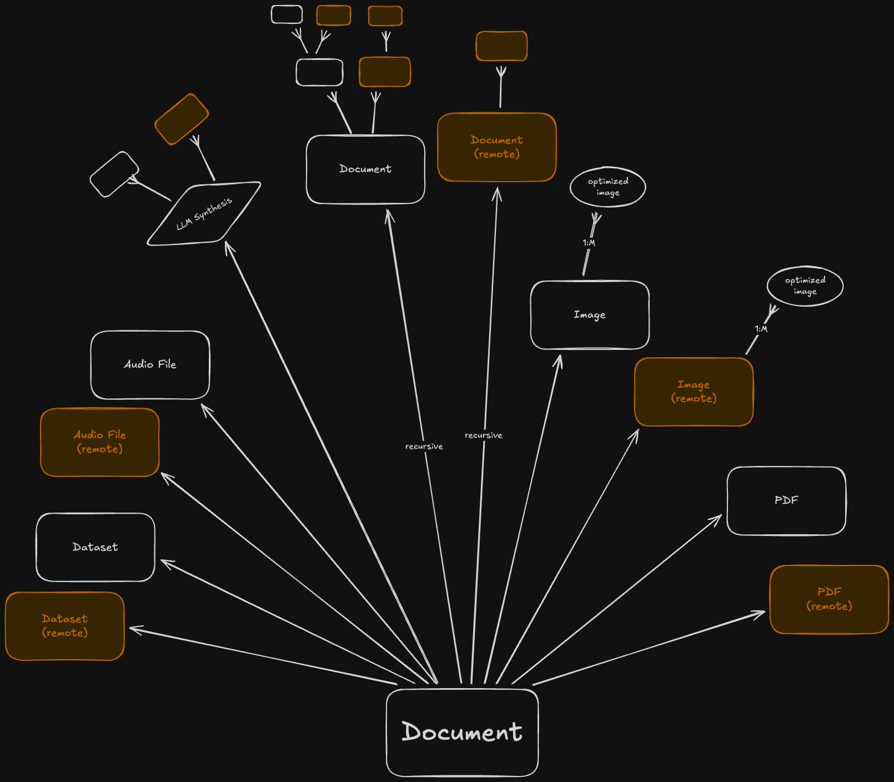

# Resources

Our solution must build a graph of resources which emanate from a set of documents.

The diagram represents just one of our root documents which we will want to render. Other root nodes will have their own acyclic dependency trees which may point to the same or other dependent nodes.

While some operations on local resources can be done very quickly, others can be expensive even when locally hosted. This necessitates **caching**. Our caching strategy should be based on the following characteristics:

- the type of node
- the location of the node (local vs remote)
- whether a node is a _leaf node_ or not

## Observations

- Leaf Types versus Recursive Types
    - `Datasets`, `Audio Files`, and `PDF`'s are always _leaf nodes_ regardless of whether they are local or remote.
    - `Images` are **never** _leaf nodes_ but they have a known/discrete number of children and a known way to convert the source `Image` into it's set of `Optimized Image`'s
    - `Documents` are variable; some are leaf nodes (aka, they have no external references) but others represent the core branches of the tree
- All remote resources are at risk becoming unavailable (permanently or temporarily)
    - this suggests that for remote resources we need more than just a "hash check" to test for changes:
        - **Refresh Interval**
            - rather than reaching out over the network and testing if the resource has changed each time we're doing a render we should have a _refresh interval_ which we wait before checking again (assuming during this window that no change has taken place).
            - The duration of the refresh interval could be global or per resource type.
        - **Ensuring Snapshot**
            - When a resource is first identified it is in our best interest in ensuring we have at least one "snapshot" of it in cache.
            - Always having at least a "fallback" allows for a more flexible handling policy when/if we encounter future resource outages
        - **Unavailability Policy Handling**
            - We need a systematic way of expressing what to do when a resource becomes un-available
- **SurrealDB** has strong graph capabilities and that should be fully leveraged as our dependency management and caching problems fit firmly into the graph domain.

## Related Docs

- [Topological Sort and other Ramblings](./topological-sort.md)

- [Caching Strategy](../design/caching-strategy.md)
- [Old Caching Strategy](../design/old-caching-strategy.md)

- [Scheduling Workloads](./work-scheduling.md)

