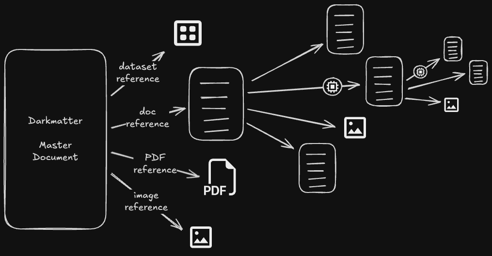

# Walking the Document Tree

- every root document represents a **root** node in a reference tree.
- this dependency tree is an acyclic DAG
- a Markdown file referencing another Markdown file is quite simple and by itself would not necessitate a caching strategy but this is the simplest of dependency trees.
    - many reference strategies like **Summarization** and **Topic Consolidation** use LLM's to produce their outputs which is compute heavy and lengthy in processing.
    - for this reason we must emphasize that walking the dependency tree in a time efficient manner is in large part to our [caching strategy](./design/cache-strategy.md)

